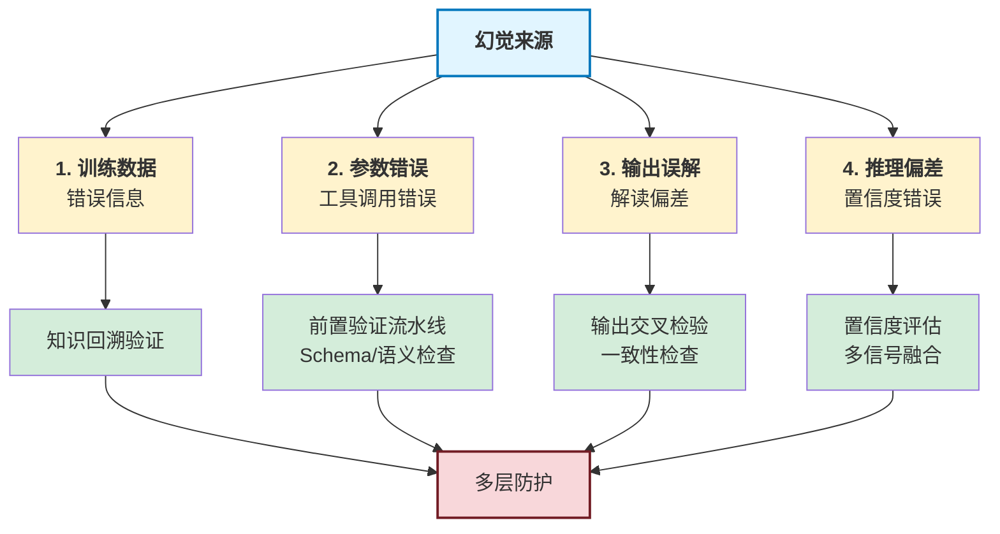
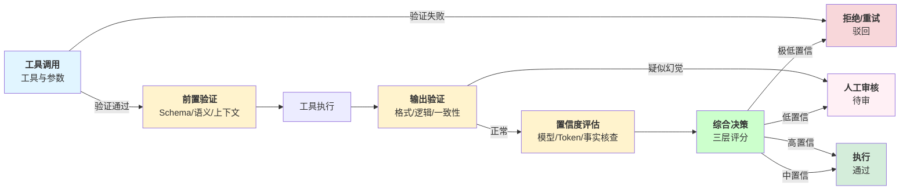

## 11.4 幻觉防护的工程实践

### 11.4.1 概述

LLM 幻觉（模型生成虚假、不准确或自相矛盾的内容）是 AI Agent 系统的主要风险。第 7 章介绍了检测方法，本节关注 **工程实践**：工具调用前验证、输出交叉检验、置信度评估和系统级幻觉防护。

### 11.4.2 幻觉的四个来源

系统幻觉防护的分层示意图如下：



图 11-6：幻觉来源与防护层

### 11.4.3 工具调用前验证管线

**参数验证与修正**
工具调用前的验证管线包含三层检查：Schema、语义和上下文。首先定义验证级别和结果结构：

```python
# core/tool_validation.py
from dataclasses import dataclass
from typing import Dict, Any, Optional, Tuple
from enum import Enum

class ValidationLevel(Enum):
    """验证严格程度"""
    STRICT = 3      # 拒绝可疑参数
    MODERATE = 2    # 尝试修正
    LENIENT = 1     # 尽量接受

@dataclass
class ValidationResult:
    """验证结果"""
    is_valid: bool
    confidence: float
    validated_params: Dict[str, Any]
    warnings: list
    corrections: Dict[str, str]
    suggestion: Optional[str] = None

class ToolValidator:
    """工具参数验证器"""

    def __init__(self, schema_registry: dict, level: ValidationLevel = ValidationLevel.MODERATE):
        self.schema_registry = schema_registry
        self.level = level

    def validate_tool_call(
        self,
        tool_name: str,
        raw_params: Dict[str, Any],
        context: Dict[str, Any] = None
    ) -> ValidationResult:
        """验证工具调用参数（三层：Schema/语义/上下文）"""
        context = context or {}
        warnings, corrections = [], {}
        validated_params = raw_params.copy()

        # 层 1：Schema 验证
        schema = self.schema_registry.get(tool_name)
        if not schema:
            return ValidationResult(
                is_valid=True, confidence=0.5,
                validated_params=validated_params,
                warnings=["No schema found"], corrections={}
            )

        schema_valid, schema_warnings, schema_corrections = self._validate_schema(
            validated_params, schema
        )
        warnings.extend(schema_warnings)
        corrections.update(schema_corrections)

        if not schema_valid and self.level == ValidationLevel.STRICT:
            return ValidationResult(
                is_valid=False, confidence=0.3,
                validated_params=validated_params,
                warnings=warnings, corrections=corrections,
                suggestion="Schema validation failed."
            )

        # 层 2：语义验证
        semantic_valid, semantic_warnings, semantic_corrections = self._validate_semantics(
            validated_params, schema, tool_name
        )
        warnings.extend(semantic_warnings)
        corrections.update(semantic_corrections)

        if not semantic_valid and self.level == ValidationLevel.STRICT:
            return ValidationResult(
                is_valid=False, confidence=0.4,
                validated_params=validated_params,
                warnings=warnings, corrections=corrections,
                suggestion="Semantic validation failed."
            )

        # 层 3：上下文验证
        context_valid, context_warnings = self._validate_context(
            validated_params, context, tool_name
        )
        warnings.extend(context_warnings)

        # 应用修正
        if self.level in (ValidationLevel.MODERATE, ValidationLevel.LENIENT):
            validated_params = self._apply_corrections(validated_params, corrections)

        confidence = max(0.0, min(1.0, 1.0 - (len(warnings) * 0.1)))
        is_valid = all([schema_valid, semantic_valid, context_valid])
        if self.level == ValidationLevel.LENIENT:
            is_valid = True

        return ValidationResult(
            is_valid=is_valid,
            confidence=confidence,
            validated_params=validated_params,
            warnings=warnings,
            corrections=corrections
        )
```

验证器的三个检查方法分别处理 Schema、语义和上下文：

```python
# ToolValidator 的检查方法
class ToolValidator:
    # ... (初始化如上)

    def _validate_schema(self, params: dict, schema: dict) -> Tuple[bool, list, dict]:
        """检查必填字段和字段类型"""
        warnings, corrections = [], {}
        properties = schema.get('properties', {})
        required = schema.get('required', [])

        for field in required:
            if field not in params:
                warnings.append(f"Missing required field: {field}")

        for field, value in params.items():
            if field not in properties:
                warnings.append(f"Unknown field: {field}")
                continue
            expected_type = properties[field].get('type')
            if not self._check_type(value, expected_type):
                warnings.append(f"Field '{field}': expected {expected_type}")
                corrected = self._try_convert_type(value, expected_type)
                if corrected is not None:
                    corrections[field] = f"Auto-converted to {expected_type}"
        return len(warnings) == 0, warnings, corrections

    def _validate_semantics(self, params: dict, schema: dict, tool_name: str) -> Tuple[bool, list, dict]:
        """检查 URL、日期、数值范围的有效性"""
        warnings, corrections = [], {}

        if 'url' in params and not self._is_valid_url(params['url']):
            warnings.append(f"Invalid URL format: {params['url']}")

        if 'date' in params and not self._is_valid_date(params['date']):
            warnings.append(f"Invalid date format: {params['date']}")

        for field in ['limit', 'page', 'score']:
            if field in params and isinstance(params[field], (int, float)):
                if field == 'limit' and not (1 <= params[field] <= 1000):
                    warnings.append(f"{field} out of range: {params[field]}")
                    corrections[field] = "Clamped to valid range"

        return len(warnings) == 0, warnings, corrections

    def _validate_context(self, params: dict, context: dict, tool_name: str) -> Tuple[bool, list]:
        """检查权限和操作冲突"""
        warnings = []

        if tool_name == 'delete_file' and context.get('user_role') == 'viewer':
            warnings.append("User may not have permission to delete files")

        if 'previous_query' in context and params.get('query') == context['previous_query']:
            warnings.append("Query is identical to previous one")

        return len(warnings) == 0, warnings

    # ... (省略辅助方法)
```

### 11.4.4 输出交叉检验

**多源验证与一致性检查**
输出验证通过多个检查来评估输出的质量。首先定义验证级别和报告：

```python
# core/output_verification.py
from typing import Dict, Any, List, Tuple
from dataclasses import dataclass
from enum import Enum

class VerificationLevel(Enum):
    """验证置信度阈值"""
    HIGH = 0.8
    MEDIUM = 0.6
    LOW = 0.4

@dataclass
class VerificationReport:
    """验证报告"""
    is_suspicious: bool
    confidence: float
    checks_passed: int
    total_checks: int
    concerns: List[str]
    recommendations: List[str]

class OutputVerifier:
    """输出验证器：四层检查"""

    def __init__(self, verification_level: VerificationLevel = VerificationLevel.MEDIUM):
        self.level = verification_level

    def verify_output(
        self,
        tool_name: str,
        tool_input: Dict[str, Any],
        tool_output: Any,
        context: Dict[str, Any] = None
    ) -> VerificationReport:
        """验证工具输出（格式/逻辑/一致性/异常检测）"""
        context = context or {}
        concerns, checks_passed, total_checks = [], 0, 0

        # 检查 1：格式验证
        total_checks += 1
        if self._check_format(tool_output, tool_name):
            checks_passed += 1
        else:
            concerns.append(f"Output format mismatch for {tool_name}")

        # 检查 2：逻辑验证
        total_checks += 1
        if self._check_logical_constraints(tool_output, tool_name):
            checks_passed += 1
        else:
            concerns.append("Output violates logical constraints")

        # 检查 3：一致性验证
        total_checks += 1
        if self._check_consistency(tool_input, tool_output, context):
            checks_passed += 1
        else:
            concerns.append("Output inconsistent with input/context")

        # 检查 4：异常检测
        hallucination_indicators = self._detect_hallucinations(tool_output, tool_name, context)
        total_checks += len(hallucination_indicators)

        for indicator, presence in hallucination_indicators.items():
            if not presence:
                checks_passed += 1
            else:
                concerns.append(f"Detected: {indicator}")

        confidence = checks_passed / total_checks if total_checks > 0 else 1.0
        is_suspicious = confidence < self.level.value
        recommendations = self._generate_recommendations(tool_name, concerns, is_suspicious)

        return VerificationReport(
            is_suspicious=is_suspicious,
            confidence=confidence,
            checks_passed=checks_passed,
            total_checks=total_checks,
            concerns=concerns,
            recommendations=recommendations
        )

    @staticmethod
    def _check_format(output: Any, tool_name: str) -> bool:
        """检查输出格式是否符合预期"""
        if tool_name == 'search':
            return isinstance(output, dict) and 'results' in output
        elif tool_name == 'fetch_url':
            return isinstance(output, str)
        elif tool_name == 'calculate':
            return isinstance(output, (int, float))
        return True

    @staticmethod
    def _check_logical_constraints(output: Any, tool_name: str) -> bool:
        """检查输出是否违反逻辑约束"""
        if isinstance(output, dict):
            for value in output.values():
                if value is None:
                    return False
        return True

    @staticmethod
    def _check_consistency(tool_input: dict, tool_output: Any, context: dict) -> bool:
        """检查输出与输入的一致性"""
        if 'query' in tool_input and isinstance(tool_output, dict):
            results = tool_output.get('results', [])
            query = tool_input.get('query', '').lower()
            if results:
                first_result = str(results[0]).lower()
                query_words = [w for w in query.split() if len(w) > 3]
                if not any(word in first_result for word in query_words):
                    return False
        return True

    @staticmethod
    def _detect_hallucinations(output: Any, tool_name: str, context: dict) -> Dict[str, bool]:
        """检测幻觉指标（自相矛盾/过度自信/不可验证/数值异常）"""
        indicators = {}

        indicators['self_contradiction'] = (
            isinstance(output, dict) and
            'true' in str(output).lower() and
            'false' in str(output).lower()
        )

        high_confidence_phrases = ['definitely', 'absolutely', 'certainly', '100%', 'always']
        indicators['overconfidence'] = (
            isinstance(output, str) and
            any(phrase in output.lower() for phrase in high_confidence_phrases)
        )

        unverifiable_patterns = ['according to my knowledge', 'i believe', 'in my opinion', 'supposedly']
        indicators['unverifiable_claims'] = (
            isinstance(output, str) and
            any(pattern in output.lower() for pattern in unverifiable_patterns)
        )

        indicators['numerical_anomaly'] = (
            isinstance(output, (int, float)) and
            output < 0 and tool_name in ['count', 'score']
        )

        return indicators

    @staticmethod
    def _generate_recommendations(tool_name: str, concerns: List[str], is_suspicious: bool) -> List[str]:
        """生成建议"""
        recommendations = []
        if is_suspicious:
            recommendations.append("Consider re-executing with different parameters")
            recommendations.append("Request user confirmation before relying on output")
        for concern in concerns:
            if 'format' in concern:
                recommendations.append("Validate output structure with tool schema")
        return recommendations
```

### 11.4.5 置信度评估

**动态置信度模型**
置信度评估通过多个信号的加权融合来产生综合评分。首先定义信号和评估结构：

```python
# core/confidence_assessment.py
from dataclasses import dataclass
from typing import Dict, List
from enum import Enum

class ConfidenceSignal(Enum):
    """置信度信号源"""
    MODEL_LOGPROBS = "model_logprobs"
    TOKEN_PROBABILITY = "token_probability"
    SEMANTIC_CONSISTENCY = "semantic_consistency"
    FACT_VERIFICATION = "fact_verification"
    COHERENCE = "coherence"
    KNOWLEDGE_GROUNDING = "knowledge_grounding"

@dataclass
class ConfidenceAssessment:
    """置信度评估结果"""
    overall_confidence: float
    signals: Dict[str, float]
    rationale: str
    recommendation: str

class ConfidenceEvaluator:
    """多信号置信度评估器"""

    def __init__(self):
        self.signal_weights = {
            ConfidenceSignal.MODEL_LOGPROBS.value: 0.25,
            ConfidenceSignal.TOKEN_PROBABILITY.value: 0.20,
            ConfidenceSignal.SEMANTIC_CONSISTENCY.value: 0.20,
            ConfidenceSignal.FACT_VERIFICATION.value: 0.20,
            ConfidenceSignal.COHERENCE.value: 0.10,
            ConfidenceSignal.KNOWLEDGE_GROUNDING.value: 0.05
        }

    def assess(
        self,
        response_text: str,
        logprobs: List[float] = None,
        context: Dict = None,
        fact_check_results: Dict = None
    ) -> ConfidenceAssessment:
        """评估响应的综合置信度"""
        signals = {}

        # 评估六个信号
        signals[ConfidenceSignal.MODEL_LOGPROBS.value] = (
            self._evaluate_logprobs(logprobs) if logprobs else 0.5
        )
        signals[ConfidenceSignal.TOKEN_PROBABILITY.value] = self._evaluate_token_probability(logprobs)
        signals[ConfidenceSignal.SEMANTIC_CONSISTENCY.value] = (
            self._evaluate_semantic_consistency(response_text, context)
        )
        signals[ConfidenceSignal.FACT_VERIFICATION.value] = (
            self._evaluate_fact_verification(fact_check_results) if fact_check_results else 0.5
        )
        signals[ConfidenceSignal.COHERENCE.value] = self._evaluate_coherence(response_text)
        signals[ConfidenceSignal.KNOWLEDGE_GROUNDING.value] = self._evaluate_grounding(response_text, context)

        # 加权求和
        overall_confidence = sum(
            signals[signal] * self.signal_weights[signal]
            for signal in signals.keys()
        )

        recommendation = self._recommend_action(overall_confidence)
        rationale = self._generate_rationale(signals, overall_confidence)

        return ConfidenceAssessment(
            overall_confidence=overall_confidence,
            signals=signals,
            rationale=rationale,
            recommendation=recommendation
        )
```

置信度评估器的六个信号评估方法：

```python
# ConfidenceEvaluator 的信号评估方法
class ConfidenceEvaluator:
    # ... (初始化如上)

    @staticmethod
    def _evaluate_logprobs(logprobs: List[float]) -> float:
        """评估对数概率（logprob 越接近 0 越自信）"""
        if not logprobs:
            return 0.5
        avg_logprob = sum(logprobs) / len(logprobs)
        # logprob 通常在 -5 到 0；映射到 0-1
        return max(0.0, min(1.0, (avg_logprob + 5) / 5))

    @staticmethod
    def _evaluate_token_probability(logprobs: List[float]) -> float:
        """评估单个 Token 的最小概率"""
        if not logprobs:
            return 0.5
        min_logprob = min(logprobs) if logprobs else 0
        return 0.3 if min_logprob < -10 else (0.8 if min_logprob > -3 else 0.5)

    @staticmethod
    def _evaluate_semantic_consistency(response_text: str, context: Dict = None) -> float:
        """检查是否包含自相矛盾"""
        contradictions = 0
        sentences = response_text.split('.')
        opposite_pairs = [('yes', 'no'), ('true', 'false'), ('always', 'never'), ('all', 'none')]

        for i in range(len(sentences) - 1):
            sent1, sent2 = sentences[i].lower(), sentences[i + 1].lower()
            for word1, word2 in opposite_pairs:
                if word1 in sent1 and word2 in sent2:
                    contradictions += 1

        consistency_score = 1.0 - (contradictions * 0.1)
        return max(0.0, min(1.0, consistency_score))

    @staticmethod
    def _evaluate_fact_verification(fact_check_results: Dict) -> float:
        """根据事实核查结果评估"""
        if not fact_check_results:
            return 0.5
        verified = fact_check_results.get('verified_count', 0)
        disputed = fact_check_results.get('disputed_count', 0)
        total = verified + disputed
        return (verified / total) if total > 0 else 0.5

    @staticmethod
    def _evaluate_coherence(response_text: str) -> float:
        """评估逻辑连贯性（基于有效句子数）"""
        sentences = response_text.split('.')
        valid_sentences = [s.strip() for s in sentences if len(s.strip()) > 10]
        if len(valid_sentences) == 0:
            return 0.3
        if len(valid_sentences) < 3:
            return 0.6
        return 0.9

    @staticmethod
    def _evaluate_grounding(response_text: str, context: Dict = None) -> float:
        """检查是否有知识基础（引用上下文）"""
        grounding_indicators = ['based on', 'according to', 'from the context', 'as mentioned']
        for indicator in grounding_indicators:
            if indicator in response_text.lower():
                return 0.8
        return 0.0

    @staticmethod
    def _recommend_action(confidence: float) -> str:
        """根据置信度推荐行动"""
        if confidence > 0.8:
            return "high_confidence"
        elif confidence > 0.6:
            return "medium_confidence"
        elif confidence > 0.4:
            return "low_confidence"
        else:
            return "manual_review"

    @staticmethod
    def _generate_rationale(signals: Dict[str, float], overall_confidence: float) -> str:
        """生成置信度理由"""
        strong_signals = [sig for sig, score in signals.items() if score > 0.75]
        weak_signals = [sig for sig, score in signals.items() if score < 0.5]
        rationale = f"Overall confidence: {overall_confidence:.2f}\n"
        if strong_signals:
            rationale += f"Strong signals: {', '.join(strong_signals)}\n"
        if weak_signals:
            rationale += f"Weak signals: {', '.join(weak_signals)}\n"
        return rationale
```

### 11.4.6 系统级幻觉防护

**完整的防护流程**



图 11-7：幻觉防护完整流程

完整的幻觉防护管线整合三层验证和决策逻辑：

```python
# examples/hallucination_defense_pipeline.py
import asyncio
from typing import Dict, Any, List

class HallucinationDefensePipeline:
    """幻觉防护管线：三层验证 + 综合决策"""

    def __init__(self):
        self.validator = ToolValidator(schema_registry={}, level=ValidationLevel.MODERATE)
        self.output_verifier = OutputVerifier(VerificationLevel.MEDIUM)
        self.confidence_evaluator = ConfidenceEvaluator()

    async def process_agent_step(
        self,
        tool_name: str,
        tool_input: Dict[str, Any],
        tool_output: Any,
        model_response: str,
        logprobs: List[float] = None,
        context: Dict = None
    ) -> Dict[str, Any]:
        """处理 Agent 一个步骤的完整幻觉防护"""
        context = context or {}

        # 层 1：工具调用前验证
        validation = self.validator.validate_tool_call(tool_name, tool_input, context)
        if not validation.is_valid:
            return {
                'status': 'validation_failed',
                'tool_name': tool_name,
                'warnings': validation.warnings,
                'suggestion': validation.suggestion,
                'action': 'request_correction'
            }

        # 层 2：输出验证
        verification = self.output_verifier.verify_output(
            tool_name, validation.validated_params, tool_output, context
        )

        # 层 3：置信度评估
        confidence = self.confidence_evaluator.assess(
            model_response,
            logprobs=logprobs,
            context=context,
            fact_check_results=context.get('fact_check_results')
        )

        # 综合决策
        decision = self._make_decision(validation, verification, confidence)

        return {
            'status': decision['status'],
            'tool_name': tool_name,
            'validation': {
                'is_valid': validation.is_valid,
                'confidence': validation.confidence,
                'warnings': validation.warnings
            },
            'verification': {
                'is_suspicious': verification.is_suspicious,
                'confidence': verification.confidence,
                'concerns': verification.concerns,
            },
            'confidence': {
                'overall': confidence.overall_confidence,
                'recommendation': confidence.recommendation
            },
            'action': decision['action'],
            'explanation': decision['explanation']
        }

    @staticmethod
    def _make_decision(validation, verification, confidence) -> dict:
        """根据三层验证做综合决策"""
        # 计算综合评分
        validation_score = validation.confidence
        verification_score = 1.0 - verification.confidence
        confidence_score = confidence.overall_confidence
        average_score = (validation_score + verification_score + confidence_score) / 3

        if average_score > 0.8:
            return {'status': 'approved', 'action': 'proceed', 'explanation': 'All checks passed'}
        elif average_score > 0.6:
            return {'status': 'caution', 'action': 'proceed_with_caution', 'explanation': 'Monitor output'}
        elif average_score > 0.4:
            return {'status': 'requires_review', 'action': 'request_human_review', 'explanation': 'Concerns found'}
        else:
            return {'status': 'rejected', 'action': 'reject_and_retry', 'explanation': 'Severe failures'}
```

使用示例展示管线的工作流程：

```python
# 使用示例
async def main():
    pipeline = HallucinationDefensePipeline()

    result = await pipeline.process_agent_step(
        tool_name='search',
        tool_input={'query': 'what is AI?', 'limit': 10},
        tool_output={'results': [{'title': 'AI Overview', 'score': 0.95}]},
        model_response='I found an article about AI...',
        logprobs=[-0.5, -0.3, -0.7, -0.4],
        context={'user_role': 'admin'}
    )

    print("Defense Pipeline Result:")
    print(f"  Status: {result['status']}")
    print(f"  Action: {result['action']}")
    print(f"  Explanation: {result['explanation']}")

if __name__ == "__main__":
    asyncio.run(main())
```

### 11.4.7 总结

幻觉防护的多层防线：

| 层级 | 防护机制 | 覆盖幻觉来源 |
|-----|--------|-----------|
| 1 | 工具调用前验证 | 参数错误导致的工具调用失败 |
| 2 | 输出交叉检验 | 工具输出误解、自相矛盾 |
| 3 | 置信度评估 | 模型不确定、自信心偏差 |
| 4 | 人工审查 | 系统级幻觉、复杂推理错误 |

配合第 7 章的检测方法，构成“预防+检测+修复”的完整幻觉防护体系。
