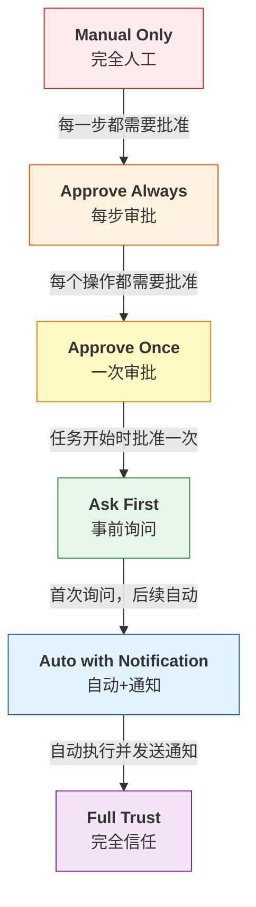

## 12.2 权限系统与沙箱设计

### 12.2.1 权限框架对比

#### Claude Code 权限框架

Claude Code 实际采用五模式权限框架（normal/auto-accept/plan/don't-ask/bypass），从完全确认到全自动。其中 normal 模式在危险操作时提示用户确认，auto-accept 模式通过 LLM 评估自动批准低风险操作，plan 模式为只读模式，don't-ask 模式自动拒绝除预批准外的操作，bypass 模式跳过所有权限检查。以下将其扩展为更细粒度的六级模型，便于理解权限决策的设计空间：

```typescript
type PermissionMode =
  | "manual_only"     // 完全人工操作
  | "approve_always"  // 每步审批
  | "approve_once"    // 一次审批
  | "ask_first"       // 事前询问
  | "auto_notification"  // 自动+通知
  | "auto_trusted"    // 完全自动

// 应用于每个工具调用
interface ToolCall {
  toolName: string;
  args: ToolArgs;
  permissionMode: PermissionMode;  // 基于风险动态决定
  confidenceScore: number;         // 模型对决策的置信度
}
```

**风险评估与权限模式映射**：

Claude Code 在 auto-accept 模式下使用两阶段 LLM 评估（而非传统 ML 分类器）来决定权限模式：第一阶段为快速保守检查，第二阶段在需要时进行链式推理分析。以下为简化的风险评估逻辑：

```python
# 特征向量 (简化)
features = {
    "tool_name": "bash",
    "arg_length": len(command),
    "contains_dangerous_pattern": has_rm_rf_pattern,
    "execution_count_today": 45,
    "user_approval_rate": 0.92,
    "similar_calls_approved": 23,
}

risk_score = risk_classifier.predict_proba(features)
# risk_score: 0.0 (低风险) -> 1.0 (高风险)

if risk_score > 0.8:
    mode = "manual_only"  # 高风险，完全人工
elif risk_score > 0.6:
    mode = "approve_always"  # 中高风险，每步审批
elif risk_score > 0.4:
    mode = "approve_once"  # 中等风险，任务开始审批
elif risk_score > 0.2:
    mode = "ask_first"  # 低中风险，事前询问
else:
    mode = "auto_notification"  # 低风险，自动+通知
```

**六模式的实际应用**：

| 模式 | 触发条件 | 行为 | 风险控制 |
|------|--------|------|---------|
| manual_only | 极高风险操作（rm -rf /）| 每步人工批准 | 完全控制 |
| approve_always | 高风险操作（delete, transfer） | 每个操作人工批准 | 逐步控制 |
| approve_once | 中高风险（任务批量操作） | 任务开始批准一次 | 计划控制 |
| ask_first | 中等风险（关键文件读取） | 首次询问，记住选择 | 选择性控制 |
| auto_notification | 低风险（日常读取、列表） | 自动执行+通知 | 事后可知 |
| auto_trusted | 极低风险（查询、计算） | 完全自动，无通知 | 最小开销 |

#### OpenClaw 权限系统

OpenClaw 实际采用三级权限系统（deny/allowlist/full），配合三种审批选项（Allow once/Always allow/Deny）和三种提示模式（off/on-miss/always）。以下将其扩展为六个权限等级，展示完整的权限梯度设计：



图 12-3：六级权限信任模型

**工作机制**：

```python
class ToolPermission(Enum):
    """工具权限等级定义(6级信任模型)"""
    MANUAL_ONLY = "manual_only"              # 完全人工操作
    APPROVE_ALWAYS = "approve_always"        # 每步都需要审批
    APPROVE_ONCE = "approve_once"            # 整个流程开始前审批一次
    ASK_FIRST = "ask_first"                  # 首次询问，后续自动
    AUTO_WITH_NOTIFICATION = "auto_with_notification"  # 自动执行+通知
    FULL_TRUST = "full_trust"                # 完全信任

# 使用示例
@tool(permission=ToolPermission.ASK_FIRST)
def read_file(path: str) -> str:
    """读取文件"""
    return open(path).read()

# 执行流程
if tool.permission == ASK_FIRST:
    if user_id not in approved_cache[tool.name]:
        approval = await ask_user_permission(f"读取文件 {path}?")
        if approval:
            approved_cache[tool.name].add(user_id)
        else:
            raise PermissionDenied()
execute_tool(tool, args)
```

**设计特点**：

- 粒度：工具级别
- 状态维护：用户×工具二维表
- 适用场景：自驱型Agent，需要用户交互反馈

**6级模型的完整支持**：

- Manual Only: 完全人工操作，每次都需要确认
- Approve Always: 每个操作都需要人工批准
- Approve Once: 任务开始时批准一次，执行过程中不再询问
- Ask First: 首次询问，后续记住用户决择，24小时有效
- Auto with Notification: 自动执行并发送通知
- Full Trust: 完全信任，无需额外验证

### 12.2.2 通用权限框架设计

综合Claude Code和OpenClaw的优点，设计一个通用框架：

#### 1. 权限定义层

权限层的基础定义：

```python
from enum import Enum
from typing import Callable, List
from dataclasses import dataclass

# 权限等级
class PermissionLevel(Enum):
    """权限等级定义(6级信任模型)"""
    DENY = 0                           # 拒绝
    MANUAL_ONLY = 1                    # 完全人工操作
    APPROVE_ALWAYS = 2                 # 每步审批
    APPROVE_ONCE = 3                   # 一次审批
    ASK_FIRST = 4                      # 事前询问
    AUTO_WITH_NOTIFICATION = 5         # 自动+通知
    FULL_TRUST = 6                     # 完全信任
    OVERRIDE = 7                       # 强制执行(仅管理员)

# 权限条件
@dataclass
class PermissionCondition:
    """权限条件：基于参数、用户、上下文的细粒度控制"""

    # 参数约束 (如路径必须在/data目录内)
    param_validator: Callable[[dict], bool]

    # 用户约束
    allowed_users: List[str] = None  # None表示所有用户

    # 时间约束
    time_window: tuple = None  # (start_hour, end_hour)

    # 频率约束
    max_calls_per_hour: int = None

    # 资源约束
    max_cpu_percent: int = 80
    max_memory_mb: int = 512
    timeout_seconds: int = 30

# 工具权限定义
@dataclass
class ToolPermissionPolicy:
    tool_name: str
    default_level: PermissionLevel
    conditions: List[PermissionCondition]

    def evaluate(self, call: "ToolCall", context: "ExecutionContext") -> PermissionLevel:
        """评估实际权限等级"""
        for condition in self.conditions:
            if condition.matches(call, context):
                return condition.permission_level
        return self.default_level
```

#### 2. 权限决策引擎

权限决策引擎的完整实现：

```python
from enum import Enum
from typing import Optional
import logging

logger = logging.getLogger(__name__)

class PermissionDecision(Enum):
    ALLOW = "allow"
    DENY = "deny"
    ASK_USER = "ask_user"

class PermissionDecisionEngine:
    def __init__(self, policy_store: dict, audit_log: "AuditLog"):
        self.policies = policy_store  # tool_name -> ToolPermissionPolicy
        self.audit_log = audit_log
        self.user_approvals = {}  # (user_id, tool_name) -> set of approved_params

    async def decide(self,
                    tool_call: "ToolCall",
                    user_id: str,
                    context: "ExecutionContext") -> PermissionDecision:
        """
        决策流程：
        1. 参数验证
        2. 权限等级评估
        3. 用户历史记录查询
        4. 最终决策
        """

        # 步骤1: 参数Schema验证
        if not self._validate_schema(tool_call):
            logger.warning(f"Schema验证失败: {tool_call}")
            self.audit_log.log("schema_validation_failed", tool_call, user_id)
            return PermissionDecision.DENY

        # 步骤2: 获取工具权限策略
        policy = self.policies.get(tool_call.tool_name)
        if not policy:
            logger.error(f"未知工具: {tool_call.tool_name}")
            return PermissionDecision.DENY

        # 步骤3: 评估权限等级
        permission_level = policy.evaluate(tool_call, context)

        # 步骤4: 基于等级决策
        if permission_level == PermissionLevel.DENY:
            logger.warning(f"权限拒绝: {tool_call.tool_name}")
            self.audit_log.log("permission_denied", tool_call, user_id)
            return PermissionDecision.DENY

        elif permission_level == PermissionLevel.OVERRIDE:
            logger.info(f"管理员覆盖: {tool_call.tool_name}")
            self.audit_log.log("override_allowed", tool_call, user_id)
            return PermissionDecision.ALLOW

        elif permission_level == PermissionLevel.FULL_TRUST:
            logger.info(f"完全信任，自动批准: {tool_call.tool_name}")
            self.audit_log.log("full_trust_approved", tool_call, user_id)
            return PermissionDecision.ALLOW

        elif permission_level == PermissionLevel.AUTO_WITH_NOTIFICATION:
            logger.info(f"自动执行并通知: {tool_call.tool_name}")
            self.audit_log.log("auto_with_notification", tool_call, user_id)
            return PermissionDecision.ALLOW

        elif permission_level == PermissionLevel.ASK_FIRST:
            # 检查用户历史批准记录
            approval_key = (user_id, tool_call.tool_name)
            if self._is_approved_before(approval_key, tool_call.args):
                logger.info(f"自动批准 (历史): {tool_call.tool_name}")
                self.audit_log.log("ask_first_cached", tool_call, user_id)
                return PermissionDecision.ALLOW
            else:
                logger.info(f"首次调用需询问: {tool_call.tool_name}")
                return PermissionDecision.ASK_USER

        else:  # APPROVE_ONCE, APPROVE_ALWAYS, MANUAL_ONLY
            return PermissionDecision.ASK_USER

    def _validate_schema(self, tool_call: "ToolCall") -> bool:
        """验证工具调用的参数Schema"""
        # 实现略
        return True

    def _is_approved_before(self, key: tuple, args: dict) -> bool:
        """检查用户是否曾批准过类似调用"""
        # 简化实现：仅检查完全相同的调用
        if key not in self.user_approvals:
            return False
        return str(args) in self.user_approvals[key]

    def record_approval(self, user_id: str, tool_name: str, args: dict):
        """记录用户批准"""
        key = (user_id, tool_name)
        if key not in self.user_approvals:
            self.user_approvals[key] = set()
        self.user_approvals[key].add(str(args))
```

#### 3. 子智能体权限冒泡

当智能体创建子Agent时，权限继承需特殊处理。Claude Code引入`permissionMode: 'bubble'`机制：

```python
class SubAgentPermissionBubbling:
    """子Agent权限冒泡管理"""

    def create_sub_agent(self,
                        parent_context: "ExecutionContext",
                        sub_agent_config: dict) -> "Agent":
        """
        创建子Agent时，若子Agent需要权限提升，
        请求冒泡到父Agent或用户
        """
        sub_agent = Agent(config=sub_agent_config)
        sub_agent.parent_context = parent_context
        sub_agent.permission_mode = 'bubble'
        return sub_agent

    async def execute_with_bubble(self,
                                 sub_agent: "Agent",
                                 tool_call: "ToolCall") -> "ToolResult":
        """
        执行子Agent工具调用，支持权限冒泡
        """
        decision = await self.decide(tool_call, sub_agent.context)

        if decision == PermissionDecision.ASK_USER:
            # 若permission_mode为'bubble'，冒泡到父级
            if sub_agent.permission_mode == 'bubble':
                parent_context = sub_agent.parent_context
                # 向用户或父Agent请求批准
                approval = await self._request_parent_approval(
                    parent_context,
                    tool_call,
                    reason="Sub-agent permission requirement"
                )
                if not approval:
                    raise PermissionDenied(f"父级拒绝了权限提升")
            else:
                # 直接询问用户
                approval = await self._request_user_approval(tool_call)
                if not approval:
                    raise PermissionDenied("用户拒绝")

        return await sub_agent.execute_tool(tool_call)
```

### 12.2.3 沙箱隔离策略

沙箱的目标是 **限制突破**：即使智能体执行恶意操作，破坏范围也受限。

#### 1. 进程级隔离

**机制**：使用操作系统原语限制单个进程的资源访问。

```python
import resource
import os

class ProcessSandbox:
    """进程级隔离：通过setrlimit限制资源"""

    def setup(self):
        # CPU时间限制(秒)
        resource.setrlimit(resource.RLIMIT_CPU, (30, 30))

        # 内存限制(字节)
        resource.setrlimit(resource.RLIMIT_AS, (512 * 1024 * 1024, 512 * 1024 * 1024))

        # 文件大小限制(字节)
        resource.setrlimit(resource.RLIMIT_FSIZE, (1024 * 1024 * 1024, 1024 * 1024 * 1024))

        # 打开文件数限制
        resource.setrlimit(resource.RLIMIT_NOFILE, (256, 256))

        # 子进程数限制
        resource.setrlimit(resource.RLIMIT_NPROC, (32, 32))

        # 禁止生成core dump
        resource.setrlimit(resource.RLIMIT_CORE, (0, 0))

def run_in_process_sandbox(tool_func, *args, **kwargs):
    """在沙箱内执行工具函数"""
    import subprocess

    code = f"""
import resource, pickle, sys
{ProcessSandbox().setup()}

try:
    result = pickle.loads(sys.stdin.buffer.read())
    output = result(*{args}, **{kwargs})
    print(pickle.dumps(output))
except Exception as e:
    print(pickle.dumps(e), file=sys.stderr)
"""

    proc = subprocess.Popen(
        ["python", "-c", code],
        stdin=subprocess.PIPE,
        stdout=subprocess.PIPE,
        stderr=subprocess.PIPE,
        preexec_fn=ProcessSandbox().setup
    )

    stdout, stderr = proc.communicate(timeout=30)
    return pickle.loads(stdout)
```

**优点**：简单，无需额外软件。
**缺点**：无法限制文件系统访问，无法隔离网络。

#### 2. 容器级隔离

**机制**：使用Docker/Podman将工具执行环境隔离在容器内。

```python
import docker
import json

class ContainerSandbox:
    """容器级隔离：每次工具调用创建新容器"""

    def __init__(self, image: str = "python:3.11-slim"):
        self.client = docker.from_env()
        self.image = image

    def run_tool(self,
                tool_code: str,
                timeout_sec: int = 30,
                memory_limit: str = "512m") -> str:
        """在容器内运行工具"""

        # 一次性容器(auto_remove=True)
        # 受限资源(mem_limit, memswap_limit)
        # 只读文件系统除了工作目录

        container = self.client.containers.run(
            self.image,
            command=["python", "-c", tool_code],

            # 资源限制
            mem_limit=memory_limit,
            memswap_limit=memory_limit,
            cpu_quota=100000,           # CPU份额
            cpu_period=100000,

            # 文件系统隔离
            read_only=True,
            volumes={"/tmp": {"bind": "/tmp", "mode": "rw"}},

            # 安全隔离
            cap_drop=["ALL"],           # 删除所有capability
            cap_add=["NET_BIND_SERVICE"],
            security_opt=["no-new-privileges"],
            pids_limit=10,              # 进程数限制

            # 网络隔离
            network_mode="none",        # 禁用网络

            # 超时
            timeout=timeout_sec,

            # 自动清理
            auto_remove=True,
            detach=False,
        )

        # 容器自动清理
        return container.decode() if isinstance(container, bytes) else str(container)

# 使用
sandbox = ContainerSandbox()
result = sandbox.run_tool(
    "print('Hello from sandbox')",
    timeout_sec=10
)
```

**优点**：强隔离，文件系统独立，网络隔离完全。
**缺点**：每次创建容器开销大（500ms-1s），资源占用多。

#### 3. 虚拟机级隔离

**机制**：使用轻量级VM（如Firecracker, gVisor）进行更强隔离。

```python
class VMSandbox:
    """VM级隔离：最强隔离，但开销最大"""

    def __init__(self, vm_image: str):
        self.vm_image = vm_image
        # 初始化Firecracker或其他轻量级VM管理器

    def run_tool(self, tool_code: str) -> str:
        """在隔离的VM内运行工具"""
        # 1. 启动VM (通常500ms)
        # 2. 注入代码
        # 3. 执行并收集结果
        # 4. 销毁VM
        pass
```

**适用场景**：极高安全要求（金融、医疗）。

#### 沙箱选择矩阵

| 隔离级别 | 开销 | 文件隔离 | 网络隔离 | 进程隔离 | 适用场景 |
|--------|-----|--------|--------|--------|--------|
| 进程 | 低 | 否 | 否 | 部分 | 开发调试 |
| 容器 | 中 | 是 | 是 | 是 | 生产环境 |
| VM | 高 | 是 | 是 | 是 | 高安全要求 |

### 12.2.4 权限与沙箱的协同

最佳实践是 **权限决策 + 沙箱执行** 的两层防护：

```python
class SecureToolExecutor:
    def __init__(self,
                 permission_engine: PermissionDecisionEngine,
                 sandbox: ContainerSandbox):
        self.permission_engine = permission_engine
        self.sandbox = sandbox

    async def execute(self,
                     tool_call: "ToolCall",
                     user_id: str,
                     context: "ExecutionContext") -> "ToolResult":

        # 第一层：权限决策
        decision = await self.permission_engine.decide(
            tool_call, user_id, context
        )

        if decision == PermissionDecision.DENY:
            raise PermissionDenied(f"Tool {tool_call.tool_name} denied")

        if decision == PermissionDecision.ASK_USER:
            approval = await self._ask_user(tool_call, user_id)
            if not approval:
                raise PermissionDenied("User rejected")

        # 第二层：沙箱执行
        result = self.sandbox.run_tool(
            tool_code=tool_call.code,
            timeout_sec=tool_call.timeout or 30,
            memory_limit="512m"
        )

        return ToolResult(output=result, success=True)
```

---

**本节总结**：权限与沙箱是防护的两个维度。权限控制 **是否允许** 执行，沙箱限制 **执行的破坏范围**。两者结合形成纵深防护。
