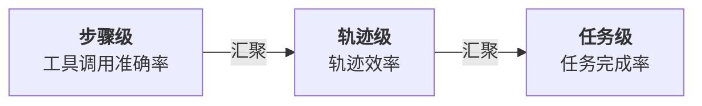

## 13.1 Harness 评估方法论

> **行业现状**
>
> LangChain《State of Agent Engineering》调研数据（1300+从业者）：
> - **52.4%** 的组织在测试集上运行离线评估
> - **37.3%** 实施在线评估(online evaluations)
> - **22.8%** 的生产阶段组织根本不做评估
> - **关键落差**：可观测性采用率 89% vs 评估采用率 52%
>
> 这说明许多团队已经能“看到”智能体在做什么，但从可观测性到质量判断仍存在采用率落差。

### 13.1.1 评估的三个层级

智能体系统的质量评估需要在三个层级进行，从细到粗：



图 13-1：智能体三层评估架构

#### 层级 1：步骤级评估

**定义**：评估单个工具调用是否正确。

**关键问题**：

- 工具选择是否正确？（调用了合适的工具吗？）
- 参数是否正确？（参数值是否符合预期？）
- 工具执行是否成功？（有无错误？）

**评估指标**：

| 指标 | 定义 | 计算 |
|-----|-----|------|
| 工具准确率 | 选择正确工具的比例 | correct_tools / total_calls |
| 参数准确率 | 参数正确的比例 | correct_params / total_params |
| 执行成功率 | 工具调用不出错的比例 | successful_calls / total_calls |

**计算示例**：

```python
from typing import List

def evaluate_step_level(trajectory: List["ToolCall"],
                       ground_truth: List["ToolCall"]) -> dict:
    """步骤级评估"""

    correct_tools = 0
    correct_calls = 0
    successful = 0
    total = len(trajectory)

    for i, predicted_call in enumerate(trajectory):
        # 工具是否正确
        if predicted_call.tool_name == ground_truth[i].tool_name:
            correct_tools += 1

        # 调用是否完全正确(工具+参数)
        if (predicted_call.tool_name == ground_truth[i].tool_name and
            predicted_call.args == ground_truth[i].args):
            correct_calls += 1

        # 执行是否成功
        if predicted_call.success:
            successful += 1

    return {
        "tool_accuracy": correct_tools / total,
        "call_accuracy": correct_calls / total,
        "execution_success_rate": successful / total,
    }
```

#### 层级 2：轨迹级评估

**定义**：评估工具调用序列的效率和正确性。

**关键问题**：

- 是否走了弯路？（多余的调用？）
- 调用顺序是否高效？（能否更快完成？）
- 是否自我纠正？（遇到错误如何反应？）

**评估指标**：

| 指标 | 定义 | 计算 |
|-----|-----|------|
| 轨迹长度效率 | 实际调用数 vs 最优调用数 | optimal_steps / actual_steps |
| 错误恢复率 | 遇到工具错误后成功恢复的比例 | recovered_errors / total_errors |
| 重复调用率 | 相同工具连续调用的次数 | duplicate_calls / total_calls |
| 平均调用深度 | 完成任务所需的平均步骤数 | sum(trajectory_lengths) / num_tasks |

**计算示例**：

```python
from typing import List

def evaluate_trajectory_level(trajectory: List["ToolCall"],
                              optimal_trajectory: List["ToolCall"]) -> dict:
    """轨迹级评估"""

    actual_length = len(trajectory)
    optimal_length = len(optimal_trajectory)

    # 调用效率
    efficiency = optimal_length / actual_length if actual_length > 0 else 0

    # 错误恢复
    errors = sum(1 for call in trajectory if not call.success)
    recovered = sum(1 for i, call in enumerate(trajectory)
                   if not call.success and i+1 < len(trajectory) and trajectory[i+1].success)
    recovery_rate = recovered / errors if errors > 0 else 0

    # 重复调用
    duplicates = sum(1 for i in range(len(trajectory)-1)
                    if trajectory[i].tool_name == trajectory[i+1].tool_name)
    duplicate_rate = duplicates / actual_length if actual_length > 0 else 0

    return {
        "efficiency": efficiency,
        "error_recovery_rate": recovery_rate,
        "duplicate_rate": duplicate_rate,
        "trajectory_length": actual_length,
        "optimal_length": optimal_length,
    }
```

#### 层级 3：任务级评估

**定义**：评估是否完成了用户的最终目标。

**关键问题**：

- 最终答案是否正确？
- 完成任务的成功率是否足够高？
- 花费的资源（token、时间、成本）是否可接受？

**评估指标**：

| 指标 | 定义 | 范围 |
|-----|-----|------|
| 任务成功率 | 完成任务的比例 | 0-100% |
| 执行时间 | 完成任务的平均时间 | 秒 |
| Token 效率 | 平均每个任务消耗的 Token | Token 数 |
| 成本效率 | 平均每个任务的 API 成本 | 美元 |
| 用户满意度 | 用户对结果的满意评分 | 1-5 分 |

**计算示例**：

```python
from datetime import datetime
from typing import List

def evaluate_task_level(results: List["TaskResult"]) -> dict:
    """任务级评估"""

    successful = sum(1 for r in results if r.success)
    total = len(results)

    # 任务成功率
    success_rate = successful / total

    # 执行时间
    execution_times = [r.end_time - r.start_time for r in results]
    avg_time = sum(execution_times) / len(execution_times)

    # Token效率
    tokens = [r.tokens_used for r in results]
    avg_tokens = sum(tokens) / len(tokens)

    # 成本效率(假设0.001美元/1000Token)
    costs = [t * 0.001 / 1000 for t in tokens]
    total_cost = sum(costs)
    avg_cost = total_cost / len(results)

    return {
        "success_rate": success_rate,
        "avg_execution_time_sec": avg_time.total_seconds(),
        "avg_tokens_per_task": avg_tokens,
        "total_cost_usd": total_cost,
        "avg_cost_per_task": avg_cost,
    }
```

### 13.1.2 评估指标体系

综合三个层级，构建完整的评估指标体系：

```python
from dataclasses import dataclass

@dataclass
class EvaluationMetrics:
    """完整的评估指标集"""

    # ======== 步骤级 ========
    tool_accuracy: float              # 工具选择准确率
    parameter_accuracy: float         # 参数准确率
    execution_success_rate: float     # 执行成功率

    # ======== 轨迹级 ========
    trajectory_efficiency: float      # 轨迹效率(最优/实际)
    error_recovery_rate: float        # 错误恢复率
    duplicate_rate: float             # 重复调用率

    # ======== 任务级 ========
    task_success_rate: float          # 任务成功率
    avg_execution_time: float         # 平均执行时间(秒)
    avg_tokens_per_task: float        # 平均Token消耗
    avg_cost_per_task: float          # 平均成本(美元)

    # ======== 综合指标 ========
    overall_quality_score: float      # 综合质量评分(0-100)

    def compute_overall_score(self) -> float:
        """
        计算综合质量评分

        权重配置：
        - 任务成功率：40%(最关键)
        - 轨迹效率：30%(关键)
        - 步骤准确率：20%(基础)
        - 成本效率：10%(现实考虑)
        """
        score = (
            self.task_success_rate * 0.4 * 100 +
            self.trajectory_efficiency * 0.3 * 100 +
            ((self.tool_accuracy + self.parameter_accuracy) / 2) * 0.2 * 100 +
            max(0, (1 - self.avg_cost_per_task / 0.1)) * 0.1 * 100  # 假设0.1美元为基准
        )
        return min(100, max(0, score))
```

### 13.1.3 评估框架架构

评估框架的核心架构实现：

```python
from abc import ABC, abstractmethod
from typing import Any, Dict, List
import logging

logger = logging.getLogger(__name__)

class Evaluator(ABC):
    """评估器基类"""

    @abstractmethod
    def evaluate(self, prediction: Any, ground_truth: Any) -> Dict[str, float]:
        """评估单个样本"""
        pass

    @abstractmethod
    def aggregate(self, results: List[Dict[str, float]]) -> EvaluationMetrics:
        """聚合多个样本的评估结果"""
        pass

class StepLevelEvaluator(Evaluator):
    """步骤级评估器"""

    def evaluate(self, predicted_call: ToolCall, ground_truth_call: ToolCall) -> Dict[str, float]:
        """评估单个工具调用"""
        tool_correct = predicted_call.tool_name == ground_truth_call.tool_name
        params_correct = predicted_call.args == ground_truth_call.args
        success = predicted_call.success

        return {
            "tool_correct": 1.0 if tool_correct else 0.0,
            "params_correct": 1.0 if params_correct else 0.0,
            "execution_success": 1.0 if success else 0.0,
        }

    def aggregate(self, results: List[Dict[str, float]]) -> Dict[str, float]:
        """聚合结果"""
        if not results:
            return {"tool_accuracy": 0, "param_accuracy": 0, "success_rate": 0}

        tool_sum = sum(r["tool_correct"] for r in results)
        param_sum = sum(r["params_correct"] for r in results)
        success_sum = sum(r["execution_success"] for r in results)
        total = len(results)

        return {
            "tool_accuracy": tool_sum / total,
            "param_accuracy": param_sum / total,
            "success_rate": success_sum / total,
        }

class TrajectoryLevelEvaluator(Evaluator):
    """轨迹级评估器"""

    def evaluate(self, trajectory: List[ToolCall],
                optimal_trajectory: List[ToolCall]) -> Dict[str, float]:
        """评估工具调用序列"""

        actual_len = len(trajectory)
        optimal_len = len(optimal_trajectory)
        efficiency = optimal_len / actual_len if actual_len > 0 else 0

        errors = sum(1 for call in trajectory if not call.success)
        if errors > 0:
            recovery = sum(1 for i in range(len(trajectory)-1)
                         if not trajectory[i].success and trajectory[i+1].success)
            recovery_rate = recovery / errors
        else:
            recovery_rate = 0

        duplicates = sum(1 for i in range(len(trajectory)-1)
                        if trajectory[i].tool_name == trajectory[i+1].tool_name)
        duplicate_rate = duplicates / actual_len if actual_len > 0 else 0

        return {
            "efficiency": efficiency,
            "recovery_rate": recovery_rate,
            "duplicate_rate": duplicate_rate,
        }

    def aggregate(self, results: List[Dict[str, float]]) -> Dict[str, float]:
        """聚合结果"""
        if not results:
            return {"avg_efficiency": 0, "avg_recovery_rate": 0, "avg_duplicate_rate": 0}

        avg_efficiency = sum(r["efficiency"] for r in results) / len(results)
        avg_recovery = sum(r["recovery_rate"] for r in results) / len(results)
        avg_duplicate = sum(r["duplicate_rate"] for r in results) / len(results)

        return {
            "avg_efficiency": avg_efficiency,
            "avg_recovery_rate": avg_recovery,
            "avg_duplicate_rate": avg_duplicate,
        }

class TaskLevelEvaluator(Evaluator):
    """任务级评估器"""

    def evaluate(self, result: TaskResult) -> Dict[str, float]:
        """评估单个任务"""
        success = 1.0 if result.success else 0.0
        time_seconds = (result.end_time - result.start_time).total_seconds()
        cost = result.tokens_used * 0.001 / 1000

        return {
            "success": success,
            "time_seconds": time_seconds,
            "tokens": float(result.tokens_used),
            "cost": cost,
        }

    def aggregate(self, results: List[Dict[str, float]]) -> Dict[str, float]:
        """聚合结果"""
        if not results:
            return {"success_rate": 0, "avg_time": 0, "avg_tokens": 0, "avg_cost": 0}

        success_sum = sum(r["success"] for r in results)
        success_rate = success_sum / len(results)

        avg_time = sum(r["time_seconds"] for r in results) / len(results)
        avg_tokens = sum(r["tokens"] for r in results) / len(results)
        avg_cost = sum(r["cost"] for r in results) / len(results)

        return {
            "success_rate": success_rate,
            "avg_time_seconds": avg_time,
            "avg_tokens": avg_tokens,
            "avg_cost_usd": avg_cost,
        }
```

### 13.1.4 技能训练评估闭环

前面的三层评估不仅能用于比较模型或 Harness 版本，也能用于优化 Skill 这类过程性知识资产。SkillOpt 一类方法的关键启发是：不要把 Skill 当作一次性手写说明，而要把它当作冻结智能体外部的一份可训练配置；模型、工具和 Harness 保持不变，真正被迭代的是指导证据收集、工具使用、验证和输出格式的 Skill 文档。

工程上可以把这个过程落成一个受控闭环：

1. **Rollout 采样**：让目标智能体在训练任务上执行当前 Skill，记录消息、工具调用、验证反馈、任务元数据和最终得分。
2. **成功/失败分组**：分别分析高分轨迹和失败轨迹，从中提取可复用过程规则，而不是只总结某个样例答案。
3. **受控文本编辑**：只允许对 Skill 做小范围的新增、删除或替换，并设置文本级学习率，避免一次大改覆盖原本有效的规则。
4. **验证集门控**：候选 Skill 只有在 held-out 任务上严格优于当前版本时才被接受；否则进入拒绝编辑缓冲区，作为下一轮优化的负反馈。
5. **产物导出**：部署时只加载最终 Skill 文件，不加载优化器、训练轨迹或历史缓冲区，从而不增加推理时调用次数。

这个闭环把“反思后自动改提示词”升级为“有验证门禁的配置训练”。它对 Harness 评估体系提出了三个额外要求：

| 要求 | 工程含义 |
|------|----------|
| 固定目标环境 | 比较 Skill 版本时，模型、工具、权限和任务集要保持一致 |
| 区分训练与选择 | 训练 rollout 的分数不能直接作为上线依据，必须保留未参与编辑的选择集 |
| 保留拒绝记录 | 被验证集拒绝的编辑是重要信号，可防止优化器反复提出破坏性改动 |

这类方法适合高重复、流程稳定、可自动评分的任务，如表格处理、搜索问答、文档理解和长时工具任务。对于低频、目标模糊或无法自动判分的任务，应优先采用人工审阅和小样本回归集，而不是让 Skill 自动演化；软件工程任务也可能受益，但需要单独设计可复现评分与回归验证。

### 13.1.5 评估结果可视化

把上面这套指标画成一页报告图，是让评估结果进入周会与版本决策的最省事方式。布局直接沿用三个层级：步骤级放工具与参数准确率，轨迹级放效率，任务级放成功率，再补上错误恢复率、平均耗时与综合评分——**六个面板恰好覆盖 13.1.1 与 13.1.2 定义的全部口径**，看图的人不必再回头翻指标定义。

具体的绘图实现属于工程细节，放在了仓库的 [tools/eval_report.py](https://github.com/yeasy/harness_engineering_guide/blob/main/tools/eval_report.py)：它自带与 13.1.2 一致的 `EvaluationMetrics` 定义，可直接运行看示例，也可以 import 其中的 `visualize_evaluation()` 传入自己流水线算出的指标。

读这张图时有一处要当心：六个面板里只有综合评分是加权合成的，其余五个是各自独立的口径，**不要横向比高低**——工具准确率 0.92 与轨迹效率 0.74 不构成「前者更好」，它们量纲不同。真正该盯的是同一格在版本之间的变化。

---

**本节总结**：Harness 系统的质量评估需要从步骤、轨迹、任务三个层级进行，每层都有特定的指标和计算方法。综合评分权衡了任务成功、效率、准确性和成本；当评估对象是 Skill 时，还要加入训练集与验证集分离、受控编辑和拒绝记录等门控机制。
