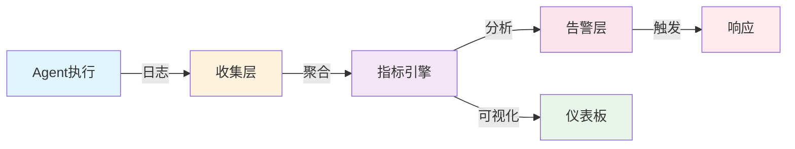

## 13.4 持续评估与监控

本节涵盖生产环境的质量监控、异常检测、A/B测试框架以及可观测性工具（Langfuse、Prometheus）的集成方案。

### 13.4.1 生产环境中的质量监控

生产系统中的智能体需要 **实时监控** 质量指标，以及时发现问题。

#### 监控架构

连续监控系统的核心架构如下：



图 13-2：生产环境监控架构

#### 关键指标

生产环境的关键指标定义：

```python
from dataclasses import dataclass
from datetime import datetime
from typing import List, Dict

@dataclass
class ProductionMetrics:
    """生产环境关键指标"""

    # 可用性指标
    uptime_percent: float              # 系统可用性
    error_rate: float                  # 错误率
    crash_rate: float                  # 崩溃率

    # 质量指标
    success_rate: float                # 任务成功率
    avg_task_duration_sec: float       # 平均任务耗时
    timeout_rate: float                # 超时率

    # 效率指标
    avg_tokens_per_task: float         # 平均Token消耗
    tool_call_accuracy: float          # 工具调用准确率
    error_recovery_rate: float         # 错误恢复率

    # 用户满意度
    user_satisfaction_score: float     # 用户满意度评分
    complaint_count: int               # 投诉数

    # 成本指标
    total_cost_usd: float              # 总成本
    cost_per_successful_task: float    # 每个成功任务的成本

    timestamp: datetime = None

class MetricsCollector:
    """指标收集器"""

    def __init__(self, window_size_minutes: int = 60):
        self.window_size = window_size_minutes * 60  # 转为秒
        self.metrics_buffer = []

    def record_execution(self,
                        task_id: str,
                        success: bool,
                        duration_sec: float,
                        tokens_used: int,
                        cost_usd: float,
                        tool_calls: int,
                        correct_tool_calls: int):
        """记录一次执行"""

        self.metrics_buffer.append({
            "task_id": task_id,
            "success": success,
            "duration": duration_sec,
            "tokens": tokens_used,
            "cost": cost_usd,
            "tool_calls": tool_calls,
            "correct_calls": correct_tool_calls,
            "timestamp": datetime.now()
        })

    def compute_metrics(self) -> ProductionMetrics:
        """计算当前指标"""

        if not self.metrics_buffer:
            return None

        # 筛选时间窗口内的数据
        now = datetime.now()
        current_data = [
            m for m in self.metrics_buffer
            if (now - m["timestamp"]).total_seconds() < self.window_size
        ]

        if not current_data:
            return None

        # 计算各项指标
        total = len(current_data)
        successful = sum(1 for m in current_data if m["success"])
        errors = total - successful

        success_rate = successful / total if total > 0 else 0
        error_rate = errors / total if total > 0 else 0

        avg_duration = sum(m["duration"] for m in current_data) / total if total > 0 else 0
        avg_tokens = sum(m["tokens"] for m in current_data) / total if total > 0 else 0
        total_cost = sum(m["cost"] for m in current_data)

        # 工具调用准确率
        total_calls = sum(m["tool_calls"] for m in current_data)
        correct_calls = sum(m["correct_calls"] for m in current_data)
        tool_accuracy = correct_calls / total_calls if total_calls > 0 else 0

        cost_per_success = total_cost / successful if successful > 0 else float('inf')

        return ProductionMetrics(
            uptime_percent=99.9,  # 从基础设施监控获取
            error_rate=error_rate,
            crash_rate=0.0,  # 从日志获取
            success_rate=success_rate,
            avg_task_duration_sec=avg_duration,
            timeout_rate=sum(1 for m in current_data if m["duration"] > 30) / total,
            avg_tokens_per_task=avg_tokens,
            tool_call_accuracy=tool_accuracy,
            error_recovery_rate=0.8,  # 需要额外逻辑计算
            user_satisfaction_score=0.0,  # 需要反馈收集
            complaint_count=0,
            total_cost_usd=total_cost,
            cost_per_successful_task=cost_per_success,
            timestamp=now
        )
```

### 13.4.2 异常检测

实现如下：

```python
from scipy import stats
import numpy as np

class AnomalyDetector:
    """异常检测"""

    def __init__(self, history_window: int = 100):
        self.history_window = history_window
        self.history = {
            "success_rate": [],
            "avg_duration": [],
            "error_rate": [],
            "tokens_per_task": []
        }

    def add_observation(self,
                       success_rate: float,
                       avg_duration: float,
                       error_rate: float,
                       tokens_per_task: float):
        """添加观测值"""

        self.history["success_rate"].append(success_rate)
        self.history["avg_duration"].append(avg_duration)
        self.history["error_rate"].append(error_rate)
        self.history["tokens_per_task"].append(tokens_per_task)

        # 保持历史窗口大小
        for key in self.history:
            if len(self.history[key]) > self.history_window:
                self.history[key].pop(0)

    def detect_anomalies(self) -> Dict[str, bool]:
        """检测异常"""

        anomalies = {}

        for metric, values in self.history.items():
            if len(values) < 10:  # 需要足够的历史数据
                continue

            # 使用Z-score检测异常
            if len(values) > 0:
                z_scores = np.abs(stats.zscore(values[-10:]))  # 最近10个数据
                current_z = z_scores[-1]

                # Z-score > 2.5 认为异常
                anomalies[metric] = current_z > 2.5

        return anomalies

    def get_recommendation(self, anomalies: Dict[str, bool]) -> str:
        """基于异常给出建议"""

        if not any(anomalies.values()):
            return "系统状态正常"

        recommendations = []

        if anomalies.get("success_rate"):
            recommendations.append("成功率异常下降,建议检查模型更新或工具配置")

        if anomalies.get("avg_duration"):
            recommendations.append("执行时间异常增加,建议检查系统负载或网络延迟")

        if anomalies.get("error_rate"):
            recommendations.append("错误率异常升高,建议查看错误日志")

        if anomalies.get("tokens_per_task"):
            recommendations.append("Token消耗异常增加,建议优化prompt工程")

        return "; ".join(recommendations)

# 异常检测使用示例
detector = AnomalyDetector()

# 模拟一段时间的正常操作
for _ in range(50):
    detector.add_observation(
        success_rate=0.92 + np.random.normal(0, 0.02),
        avg_duration=5.0 + np.random.normal(0, 0.5),
        error_rate=0.08 + np.random.normal(0, 0.02),
        tokens_per_task=250 + np.random.normal(0, 20)
    )

# 模拟一个异常事件
for _ in range(5):
    detector.add_observation(
        success_rate=0.70,  # 异常下降
        avg_duration=8.5,   # 异常增加
        error_rate=0.30,    # 异常增加
        tokens_per_task=400 # 异常增加
    )

anomalies = detector.detect_anomalies()
print(f"检测到异常: {anomalies}")
print(f"建议: {detector.get_recommendation(anomalies)}")
```

### 13.4.3 A/B测试框架

具体实现如下：

```python
from enum import Enum
from typing import Callable
import random

class Treatment(Enum):
    """A/B测试中的处理"""
    CONTROL = "control"    # 对照组(现有系统)
    EXPERIMENTAL = "experimental"  # 实验组(新系统)

class ABTestManager:
    """A/B测试管理"""

    def __init__(self, split_ratio: float = 0.5):
        self.split_ratio = split_ratio  # 0.5 = 50% 分配给实验组
        self.results = {
            "control": [],
            "experimental": []
        }

    def assign_treatment(self, user_id: str) -> Treatment:
        """分配处理"""
        # 使用hash确保同一用户始终分配到同一组
        hash_value = hash(user_id) % 100
        if hash_value < self.split_ratio * 100:
            return Treatment.EXPERIMENTAL
        else:
            return Treatment.CONTROL

    async def run_task(self,
                      user_id: str,
                      agent_control: "Agent",
                      agent_experimental: "Agent",
                      task: str):
        """运行A/B测试"""

        treatment = self.assign_treatment(user_id)

        if treatment == Treatment.CONTROL:
            result = await agent_control.execute(task)
            group = "control"
        else:
            result = await agent_experimental.execute(task)
            group = "experimental"

        # 记录结果
        self.results[group].append({
            "user_id": user_id,
            "success": result.success,
            "duration": result.duration,
            "tokens": result.tokens_used,
            "cost": result.cost
        })

        return result

    def compute_statistics(self) -> Dict:
        """计算统计显著性"""

        control_results = self.results["control"]
        exp_results = self.results["experimental"]

        if not control_results or not exp_results:
            return {"significant": False, "reason": "数据不足"}

        # 计算成功率
        control_sr = sum(1 for r in control_results if r["success"]) / len(control_results)
        exp_sr = sum(1 for r in exp_results if r["success"]) / len(exp_results)

        # 计算平均执行时间
        control_duration = sum(r["duration"] for r in control_results) / len(control_results)
        exp_duration = sum(r["duration"] for r in exp_results) / len(exp_results)

        # 简单的显著性检验:如果差异>5%且样本足够
        sample_sufficient = len(control_results) >= 30 and len(exp_results) >= 30
        sr_improvement = exp_sr - control_sr
        significant = sample_sufficient and abs(sr_improvement) > 0.05

        return {
            "significant": significant,
            "control_success_rate": control_sr,
            "experimental_success_rate": exp_sr,
            "improvement": sr_improvement,
            "control_avg_duration": control_duration,
            "experimental_avg_duration": exp_duration,
            "sample_size_control": len(control_results),
            "sample_size_experimental": len(exp_results)
        }

# A/B测试使用示例
ab_test = ABTestManager(split_ratio=0.5)

# 运行测试...
# stats = ab_test.compute_statistics()
# if stats["significant"] and stats["improvement"] > 0:
#     print("实验组显著优于对照组,建议上线")
```

### 13.4.4 可观测性工具集成

#### Langfuse 集成

代码如下：

```python
from langfuse import Langfuse

class LangfuseIntegration:
    """Langfuse可观测性集成"""

    def __init__(self, api_key: str):
        self.langfuse = Langfuse(api_key=api_key)

    def log_execution(self,
                     task_id: str,
                     instruction: str,
                     tool_calls: List,
                     result: Any,
                     metadata: Dict = None):
        """记录执行到Langfuse"""

        trace = self.langfuse.trace(
            id=task_id,
            name="Agent Execution",
            metadata=metadata or {}
        )

        # 记录步骤
        for i, call in enumerate(tool_calls):
            trace.span(
                name=f"Tool Call {i+1}",
                input={
                    "tool": call.tool_name,
                    "args": call.args
                },
                output={
                    "success": call.success,
                    "result": call.result
                },
                level="DEBUG"
            )

        # 记录最终结果
        trace.span(
            name="Task Complete",
            output={
                "success": result.get("success"),
                "duration": result.get("duration"),
                "tokens": result.get("tokens_used")
            }
        )

        self.langfuse.flush()  # 确保数据被发送

# Langfuse集成使用
langfuse = LangfuseIntegration(api_key="your-key")
langfuse.log_execution(
    task_id="task_001",
    instruction="分析文件",
    tool_calls=[...],
    result={...}
)
```

#### Prometheus 指标导出

实现如下：

```python
from prometheus_client import Counter, Histogram, Gauge

class PrometheusMetrics:
    """Prometheus指标导出"""

    def __init__(self):
        # 计数器
        self.task_counter = Counter(
            'agent_tasks_total',
            'Total tasks executed',
            ['status']  # success/failure
        )

        # 直方图(执行时间分布)
        self.execution_time = Histogram(
            'agent_task_duration_seconds',
            'Task execution duration',
            buckets=(1, 2, 5, 10, 30, 60)
        )

        # 仪表盘(当前成功率)
        self.success_rate = Gauge(
            'agent_success_rate',
            'Current success rate'
        )

        # 计数器(Token消耗)
        self.tokens_counter = Counter(
            'agent_tokens_total',
            'Total tokens used'
        )

    def record_task_result(self,
                          success: bool,
                          duration_sec: float,
                          tokens_used: int,
                          success_rate: float):
        """记录任务结果"""

        status = "success" if success else "failure"
        self.task_counter.labels(status=status).inc()
        self.execution_time.observe(duration_sec)
        self.tokens_counter.inc(tokens_used)
        self.success_rate.set(success_rate)

# Prometheus指标导出使用
prometheus = PrometheusMetrics()
prometheus.record_task_result(
    success=True,
    duration_sec=5.2,
    tokens_used=250,
    success_rate=0.92
)
```

---

**本节总结**：生产环境需要实时监控关键指标，使用异常检测发现问题，通过A/B测试验证改进，利用Langfuse/Prometheus等工具提升可观测性。持续评估是确保系统质量的关键。
