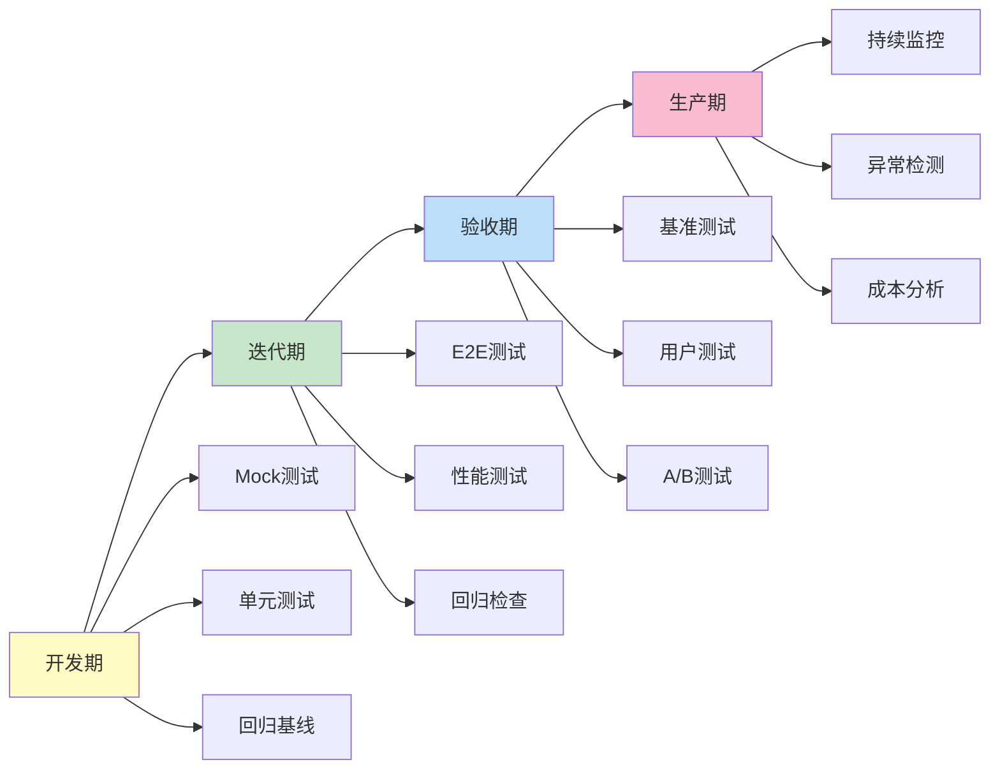
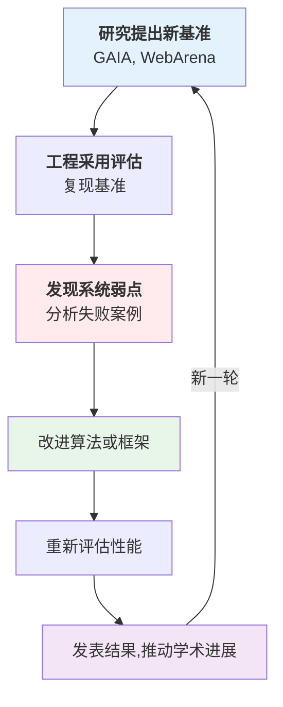

## 本章小结

本章阐述了智能体系统的多层级评估方法，以下是核心要点的总结。

### 核心要点回顾

#### 1. 评估的三层级架构

智能体系统的评估需要从 **步骤、轨迹、任务** 三个层级进行：

- **步骤级**：单个工具调用的准确性（工具选择、参数正确性、执行成功性）
- **轨迹级**：工具调用序列的效率（最优性比、错误恢复率、重复率）
- **任务级**：最终目标达成（成功率、执行时间、Token 效率、成本）

三者环环相扣，步骤级的准确性支撑轨迹级的效率，轨迹级的优化保证任务级的成功。

#### 2. Mock vs 真实测试的取舍

- **Mock 测试**：快速、确定性强、易隔离问题，适合开发迭代
- **真实测试**：真实度高、能发现 Mock 无法发现的问题，适合验收阶段

**最佳实践**：开发期用 Mock 确保快速反馈，发布前用真实测试验证。

#### 3. 基准测试的标准化

四大学术基准各有侧重：

| 基准 | 焦点 | 任务数 | 难度 |
|-----|-----|-------|------|
| GAIA | 推理+工具使用 | 466 | 三级 |
| WebArena | 网页自动化 | 812 | 真实网站 |
| SWE-Bench | 代码修改 | 2294 | 真实 GitHub 问题 |
| AgentBench | 多领域综合 | 8 个环境 | 工作场景模拟 |

在自有系统上复现这些基准，能客观评估智能体能力。NIST 2026 标准化倡议将进一步统一评估方法。

#### 4. 生产环境的持续监控

三个维度的实时监控：

**质量指标**：成功率、错误恢复率、执行时间
**异常检测**：Z-score 等统计方法自动识别性能下滑
**A/B 测试**：科学验证系统改进是否显著优于基线

配合 Langfuse/Prometheus 等工具，实现完整的可观测性。

#### 5. 完整测试套件

MiniHarness 的四层测试确保全面覆盖：

1. **单元测试**：路径校验、命令检测等模块单独验证
2. **集成测试**：权限流程、护栏集成等模块间协作验证
3. **端到端测试**：完整工作流验证
4. **性能基准**：延迟、吞吐量等性能指标验证

### 评估框架选择指南

根据项目阶段选择合适的评估方法：

### 常见评估误区

#### 误区 1：只看任务成功率

**问题**：成功率高但单个任务消耗大量 Token，成本难以承受。
**正确做法**：平衡成功率、效率、成本的加权评分。

#### 误区 2：用人工评分代替自动化

**问题**：不可扩展，主观性强，难以持续监控。
**正确做法**：优先建立自动化指标，人工评分仅用于难以自动化的维度。

#### 误区 3：忽视生产与开发的差异

**问题**：开发期性能好，上线后性能下降（冷启动、真实流量等）。
**正确做法**：生产环境需专门的监控和告警机制。

#### 误区 4：基准测试过度参考

**问题**：优化以适应基准，但在真实场景表现不佳（对标优化）。
**正确做法**：基准用于建立基线，但要结合业务 KPI 调整权重。

### 评估成本考虑

| 评估方法 | 成本 | 时间 | 精度 |
|--------|-----|-----|------|
| Mock 测试 | 低 | 快（秒） | 中 |
| E2E 测试 | 中 | 中（分钟） | 高 |
| 真实 API 调用 | 高 | 慢（秒/调用） | 最高 |
| 基准测试 | 中 | 中（小时） | 高 |
| 持续监控 | 中 | 实时 | 高 |

**成本优化**：结合 Mock 和采样真实调用，控制整体成本。

### 与 AI 研究的联系

学术研究与工程实践的反馈循环：

本章的评估方法论正是这个循环的工程侧面。

### 生产就绪检查清单

部署前确保：

- [ ] 建立了三层级评估指标体系
- [ ] 准备了 Mock 和真实两套测试用例
- [ ] 在至少一个学术基准上验证了性能基线
- [ ] 实现了实时监控和异常告警
- [ ] 设计了 A/B 测试框架用于验证改进
- [ ] 测试覆盖率≥80%
- [ ] 有专门的性能基准跟踪
- [ ] 建立了用户反馈收集机制
- [ ] 准备好了性能退化的应急响应
- [ ] 定期进行评估和优化周期

---

**完成第 13 章意味着掌握了“如何衡量好坏”的系统方法。下一章展望 Harness 工程的未来方向——从今天的工程实践走向明天的范式创新。**
