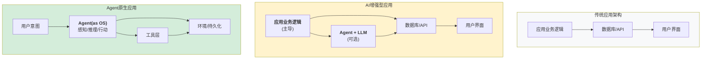
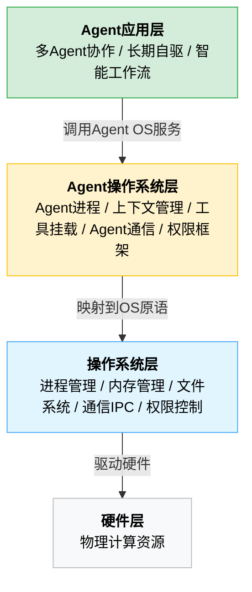

## 14.1 智能体原生应用

本节探讨从AI增强型应用向智能体原生应用的演进，阐述智能体即操作系统的愿景、关键技术挑战以及多智能体协作的实现模式。

### 14.1.1 从AI增强到智能体原生

当前的智能体应用大多是 **AI增强**(AI-Enhanced)的变体：



图 14-1：应用架构演进

关键差异：

| 维度 | AI增强型 | 智能体原生型 |
|-----|--------|-----------|
| 核心驱动 | 传统代码逻辑 | 智能体推理 |
| 控制流 | 过程式/事件驱动 | 自主目标导向 |
| 适配性 | 固定的API契约 | 动态的能力发现 |
| 失败处理 | 异常处理 | 自我修正与重试 |
| 学习能力 | 无（非学习系统） | 有（从经验改进） |

### 14.1.2 智能体即操作系统愿景

**智能体即操作系统(Agent-as-OS)** 是智能体原生应用的终极形态。传统OS的职责扩展到智能体：



图 14-2：Agent操作系统架构堆栈

#### 传统操作系统的核心职责

1. **进程管理**：创建、调度、销毁任务
2. **内存管理**：分配隔离的内存空间
3. **文件系统**：持久化存储管理
4. **通信**：进程间通信(IPC)
5. **权限控制**：访问控制与安全

#### 智能体操作系统中的对应角色

智能体操作系统的概念设计如下：

```python
class AgentOS:
    """Agent操作系统概念设计"""

    def __init__(self):
        self.process_manager = AgentProcessManager()      # 进程管理
        self.memory_manager = AgentMemoryManager()        # 上下文/内存管理
        self.tool_filesystem = ToolFilesystem()          # 工具即文件系统
        self.ipc = InterAgentCommunication()             # 多Agent通信
        self.security = SecurityManager()                # 权限和安全

    async def spawn_agent(self,
                         objective: str,
                         tools: List[Tool],
                         context: dict = None) -> "Agent":
        """创建一个Agent进程"""
        agent = Agent(
            objective=objective,
            tools=tools,
            context=context,
            os=self
        )
        await self.process_manager.register(agent)
        return agent

    async def allocate_context(self,
                              agent_id: str,
                              size_tokens: int) -> "ContextWindow":
        """为Agent分配上下文窗口(类似内存分配)"""
        return await self.memory_manager.allocate(agent_id, size_tokens)

    async def mount_tools(self,
                         agent_id: str,
                         tools: List[Tool]) -> None:
        """将工具挂载为"文件系统"(工具发现与调用)"""
        await self.tool_filesystem.mount(agent_id, tools)

    async def send_message(self,
                          from_agent: str,
                          to_agent: str,
                          message: str) -> None:
        """Agent间通信"""
        await self.ipc.send(from_agent, to_agent, message)

    async def enforce_permissions(self,
                                 agent_id: str,
                                 tool_name: str) -> bool:
        """权限检查(第12章的Permission Engine)"""
        return await self.security.check_permission(agent_id, tool_name)
```

#### 智能体操作系统的应用场景

**1. 多智能体协作系统**

```python
async def collaborative_task():
    """多个智能体协作解决复杂问题"""

    os = AgentOS()

    # 创建专用Agent
    researcher = await os.spawn_agent(
        objective="研究问题背景",
        tools=["search_web", "read_document"]
    )

    analyst = await os.spawn_agent(
        objective="分析研究结果",
        tools=["data_analysis", "visualization"]
    )

    writer = await os.spawn_agent(
        objective="撰写报告",
        tools=["write_document", "format_text"]
    )

    # Agent间通信
    research_result = await researcher.execute()
    await os.send_message("researcher", "analyst", research_result)

    analysis = await analyst.execute()
    await os.send_message("analyst", "writer", analysis)

    report = await writer.execute()
    return report
```

**2. 长期自驱智能体**

```python
class AlwaysOnAssistant:
    """持久化的自驱Assistant(KAIROS模式)"""

    def __init__(self):
        self.os = AgentOS()
        self.persistence = PersistenceLayer()
        self.heartbeat_interval = 300  # 5分钟

    async def start_heartbeat(self):
        """心跳机制：定期检查待办事项"""
        while True:
            # 从持久化存储读取状态
            state = await self.persistence.load_state()

            # 检查是否有待处理的任务或消息
            pending = await self.persistence.get_pending_actions()

            if pending:
                # 恢复智能体并继续执行
                agent = await self.os.spawn_agent(
                    objective="处理待处理任务",
                    tools=state.get("tools", []),
                    context=state.get("context", {})
                )
                await agent.execute()

            # 持久化智能体状态
            await self.persistence.save_state(agent.state)

            # 等待下一个心跳
            await asyncio.sleep(self.heartbeat_interval)

# OpenClaw中的Heartbeat自驱模式是智能体操作系统的早期形态
```

**3. 智能流程自动化**

```python
async def intelligent_workflow():
    """智能体驱动的动态工作流"""

    os = AgentOS()

    # 智能体自主决定下一步(不是预先定义的流程)
    current_agent = await os.spawn_agent(
        objective="处理客户投诉",
        tools=["read_email", "access_database", "draft_response"]
    )

    while True:
        # 智能体执行并决定下一步
        action = await current_agent.decide_next_action()

        if action.type == "transfer":
            # 动态转交给其他智能体
            current_agent = await os.spawn_agent(
                objective=action.objective,
                tools=action.required_tools,
                context=action.context  # 传递上下文
            )
        elif action.type == "complete":
            break
        elif action.type == "escalate":
            # 升级到人工
            break
```

### 14.1.3 技术挑战

#### 1. 上下文持久化

**问题**：传统应用数据可以持久化到数据库，但智能体的 **推理状态** 无法显式存储。

**当前方案**：

- 将上下文的关键决定点序列化存储
- 重启时重新执行推理恢复状态
- 成本：O(历史长度)

**未来方向**：

```python
class PersistentContext:
    """持久化推理上下文"""

    async def checkpoint(self):
        """定期保存推理检查点"""
        # 不仅保存最终答案，也保存中间推理步骤
        checkpoint = {
            "timestamp": now(),
            "reasoning_steps": self.reasoning_trace,
            "decisions": self.decision_log,
            "context_window": self.current_context,
            "learned_facts": self.extracted_knowledge,
        }
        await self.storage.save(checkpoint)

    async def restore(self, checkpoint_id):
        """从检查点恢复"""
        checkpoint = await self.storage.load(checkpoint_id)
        self.reasoning_trace = checkpoint["reasoning_steps"]
        self.decision_log = checkpoint["decisions"]
        # ...
```

#### 2. 多智能体协调

**问题**：多个智能体可能有冲突的目标或输出，如何协调？

**当前方案**：中央调度器（智能体操作系统）仲裁

**挑战**：

- 如何设计智能体间的通信协议
- 如何检测和解决冲突
- 如何确保整体系统稳定性

#### 3. 能力发现与绑定

**问题**：智能体操作系统需要动态发现可用的工具和能力

**MCP(Model Context Protocol)的角色**：

- 标准化工具定义
- 支持动态能力查询
- MCP 路线图中规划了能力协商(capability negotiation)和 Server Cards 等特性

#### 4. 学习与自适应

**问题**：智能体操作系统中的智能体应该如何从经验学习？

**两种层级的学习**：

1. **单体智能体学习**：

   - 当前Harness中缺失
   - 未来可通过微调或检索增强学习

2. **系统级学习**：

   - 跨智能体的知识共享
   - 整个智能体操作系统的性能优化
   - 需要新的架构（如中央知识库）

```python
class AgentSystemLearning:
    """智能体操作系统级学习"""

    async def share_knowledge(self,
                            source_agent: str,
                            knowledge: dict,
                            scope: str = "global"):
        """共享知识
        scope: "global" (全系统) / "team" (同团队) / "private" (私有)
        """
        await self.knowledge_store.save(
            source_agent,
            knowledge,
            scope=scope
        )

    async def learn_from_failure(self,
                                failed_agent: str,
                                error: Exception,
                                context: dict):
        """从失败学习"""
        # 1. 记录失败原因
        failure_case = {
            "agent": failed_agent,
            "error": error,
            "context": context,
            "timestamp": now()
        }
        await self.failure_store.save(failure_case)

        # 2. 其他智能体避免相同错误
        similar_agents = await self.find_similar_agents(failed_agent)
        for agent_id in similar_agents:
            await self.notify_agent(
                agent_id,
                f"避免在类似场景下使用: {error}"
            )
```

---

**本节总结**：智能体原生应用代表了 Harness 工程的终极形态——从工具调用框架演进为 **自主操作系统**。虽然当前还有许多技术挑战，但 OpenClaw 的自驱模式和 MCP 标准已经指向这个方向。
