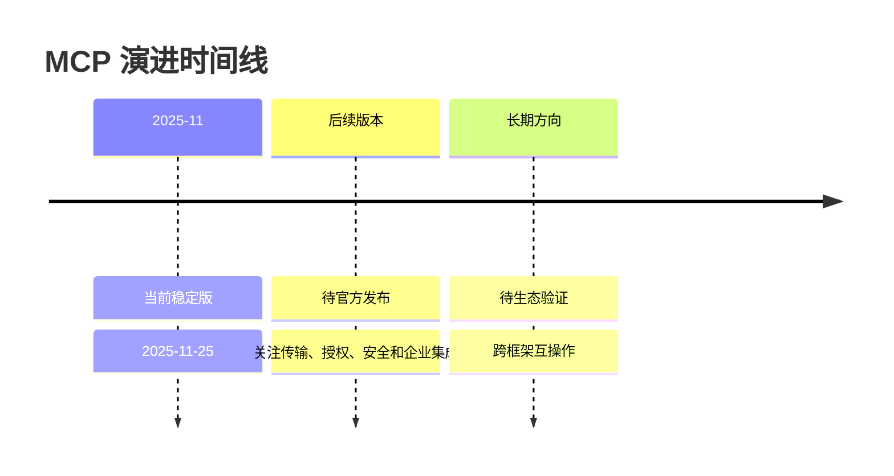
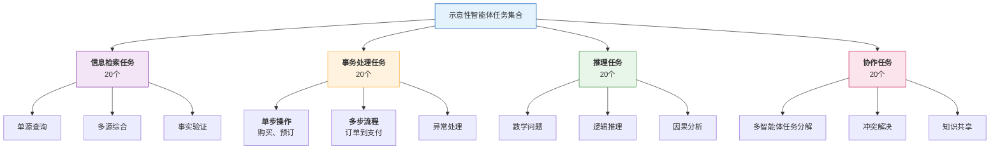
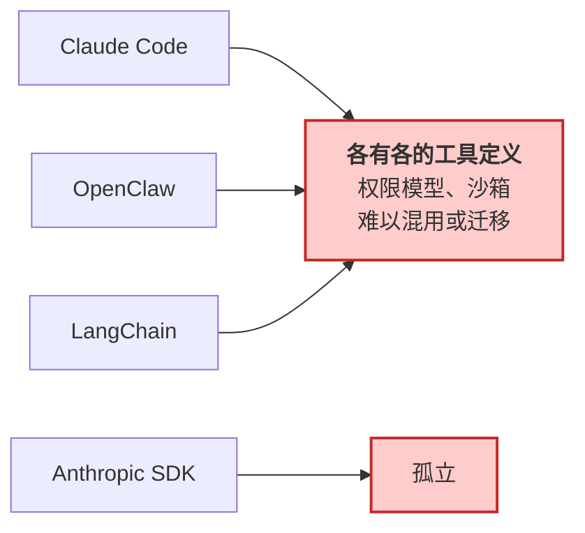
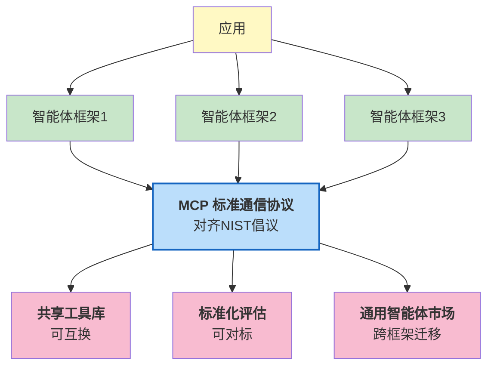
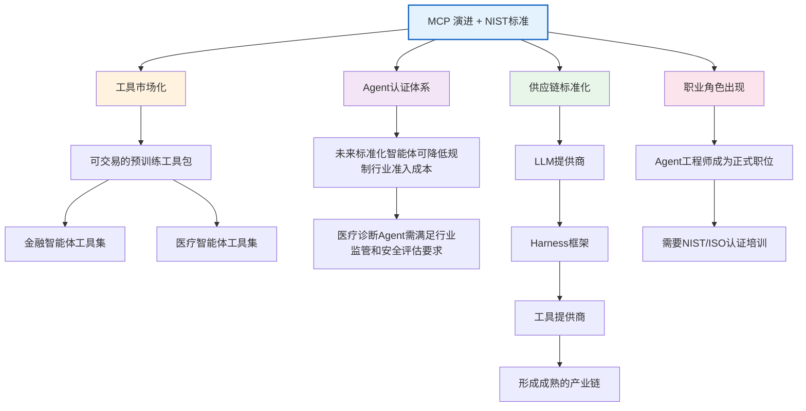

## 14.2 标准化演进

本节阐述智能体系统的标准化方向，包括MCP的技术演进、NIST标准化倡议、框架间互操作性以及智能体协议栈的完整生态。

### 14.2.1 MCP 的演进路线图

MCP(Model Context Protocol)采用日期版本号；当前官方 latest 路径指向 2025-11-25。由于协议仍在迭代，正文只描述当前规范中可确认的机制，并把未来能力作为示意性方向处理。

**MCP 当前版本：**

**核心特性**：

- 工具定义的通用格式(JSON Schema)
- 客户端-服务器通信模型
- 支持 stdio（本地子进程）和 Streamable HTTP（远程服务）两种传输层
- 进度、取消、日志等通用能力可配合长时操作使用
- 动态工具注册（通过 `notifications/tools/list_changed` 通知）

**当前限制**：

- 工具定义虽支持动态注册，但大多数实现仍以启动时静态注册为主
- 缺乏正式的智能体间通信标准
- 企业级特性（审计、SSO、网关）仍在规划中

> **注**：早期版本曾使用 SSE(Server-Sent Events)作为独立传输层，已在 2025-03-26 版本中废弃，统一为 Streamable HTTP。

**MCP 下一代演进：**

**特性1：动态能力协商**

以下“动态能力协商”是 Harness 可能采用的扩展设计，用来说明未来方向；它不是当前 MCP 规范或官方 SDK 中的 API：

```python
# MCP 下一代 - 动态能力协商
@dataclass
class CapabilityQuery:
    """智能体查询可用能力"""
    agent_id: str
    required_capabilities: List[str]  # ["read_file", "write_file"]
    optional_capabilities: List[str]
    resource_constraints: dict        # {"memory_mb": 512, "timeout_sec": 30}

@dataclass
class CapabilityOffer:
    """服务提供的能力"""
    capabilities: List[ToolDefinition]
    cost: dict                        # {"latency_ms": 100, "cost_usd": 0.001}
    constraints: dict                 # {"rate_limit": 100_per_hour}

async def negotiate_capabilities(query: CapabilityQuery) -> CapabilityOffer:
    """动态协商能力

    LLM不再依赖启动时加载的工具列表,而是在运行时查询可用能力
    """
    pass
```

**应用场景**：

```python
# 示例：智能体需要处理PDF,检查是否有能力
query = CapabilityQuery(
    agent_id="data-analyzer",
    required_capabilities=["read_pdf", "extract_text"],
    optional_capabilities=["ocr_scan"],
    resource_constraints={"memory_mb": 256}
)

# MCP 服务返回可用的实现
capabilities = await mcp_server.negotiate(query)

if "read_pdf" in capabilities:
    # 使用该能力
    pdf_content = await agent.call_tool("read_pdf", file_path="doc.pdf")
else:
    # 降级方案：上传到云服务
    await agent.call_tool("upload_to_cloud", file_path="doc.pdf")
```

**特性2：增强的持久化会话与流式通信**

当前 MCP 已通过 Streamable HTTP 支持 HTTP POST/GET、可选 SSE 流式响应、会话 ID、恢复与重投递等机制。下面的“增强持久化会话”是概念示意，不代表当前规范已有同名 API：

```python
# MCP 下一代 - 增强持久化会话
class StreamingMCPSession:
    """支持流式通信的持久化会话"""

    async def open_stream(self, agent_id: str) -> Stream:
        """打开持久化流"""
        # 保持连接开放,支持实时推送(而不仅是请求-响应)
        pass

    async def push_event(self, event: Event):
        """服务器主动推送事件到智能体"""
        # 例：外部事件到达,直接推送给Agent
        # 当前MCP通过SSE支持服务端推送,但缺乏完整的事件订阅机制
        pass

    async def bidirectional_tool_call(self):
        """工具可以回调Agent"""
        # 当前：智能体 -> 工具(单向为主)
        # 下一代：工具 -> 智能体(完整的反向调用支持)
        # 应用：工具需要智能体决策时
        pass
```

**特性3：智能体间通信标准**

实现如下：

```python
# MCP 下一代 - 智能体间通信
@dataclass
class AgentMessage:
    from_agent: str
    to_agent: str
    message_type: str              # "request", "response", "event"
    content: dict
    correlation_id: str            # 追踪相关消息

class AgentProtocolCommunication:
    """未来 MCP 或 A2A 类协议可能支持的智能体间通信"""

    async def send_message(self, msg: AgentMessage) -> None:
        """智能体A发送消息给智能体B"""
        # 若未来 MCP 或 A2A 类协议提供标准消息路由，可在此接入
        pass

    async def broadcast_event(self, event: dict, target_group: str) -> None:
        """广播事件到智能体组"""
        # 类似发布-订阅
        pass

    async def request_capability(self,
                                requesting_agent: str,
                                capability: str,
                                params: dict) -> Any:
        """跨智能体能力请求"""
        # 智能体A要求智能体B执行某个能力
        pass
```

**应用例**：多智能体协作

```python
async def collaborative_data_analysis():
    """多智能体协作分析(MCP下一代版本支持)"""

    # 智能体A(爬虫)向智能体B(分析员)发送数据
    message = AgentMessage(
        from_agent="scraper_agent",
        to_agent="analyst_agent",
        message_type="request",
        content={"data": scraped_data, "analysis_type": "statistical"}
    )

    await mcp_server.send_message(message)

    # 智能体B接收并处理
    result = await analyst_agent.process_request(message)

    # 智能体B响应智能体A
    response = AgentMessage(
        from_agent="analyst_agent",
        to_agent="scraper_agent",
        message_type="response",
        content=result
    )

    await mcp_server.send_message(response)
```

**MCP 演进时间线：** 官方规范使用日期版本号发布。下面仅保留确定的当前版本，并把后续方向写成待观察事项，避免把社区讨论或预测写成官方路线图：



图 14-3：MCP 标准演进路线图

### 14.2.2 NIST AI智能体标准化

NIST 的 CAISI(Center for AI Standards and Innovation)于 2026 年 2 月 17 日正式发起 AI Agent 标准化倡议，聚焦三大战略支柱：行业标准制定与国际标准话语权、开源协议社区发展、以及智能体安全与身份研究。其目标是建立 **跨行业的智能体系统标准**。

**标准化可能覆盖的关键领域**

下面的能力等级、检查清单和任务集合是本书基于 NIST 倡议方向抽象出的示意性评估框架，不是 NIST 已发布的官方合规 API、能力等级或标准任务集。实际标准、术语和时间表应以 NIST 后续正式发布为准。

#### 1. 功能分类与能力等级

分类如下：

```text
Level 1: 基础工具调用
  - 单步工具调用
  - 简单参数
  - 示例：单个文件操作、查询API

Level 2: 多步推理
  - 多步工具链
  - 错误恢复
  - 示例：复杂数据分析、问题求解

Level 3: 自适应规划
  - 动态工具选择
  - 目标分解
  - 示例：长期项目规划、复杂系统设计

Level 4: 多智能体协调
  - 智能体间通信
  - 分布式执行
  - 示例：组织协作、跨域问题解决

Level 5: 持久自主系统
  - 长期记忆
  - 自主学习
  - 示例：智能体操作系统、完全自驱助手

```

#### 2. 安全性基线

评估方案如下：

```python
class AgentSecurityBaselineExample:
    """示意性的智能体安全基线，不代表 NIST 已发布标准"""

    @staticmethod
    def evaluate_system(agent_system) -> SecurityReport:
        """评估系统的安全合规性"""

        report = SecurityReport()

        # Category 1: 工具调用安全
        report.tool_safety = {
            "dangerous_command_detection": True,      # 12.3
            "path_validation": True,                  # 12.4
            "parameter_validation": True,
            "rate_limiting": True,
        }

        # Category 2: 隐私保护
        report.privacy = {
            "data_minimization": check_data_minimization(agent_system),
            "encryption_at_rest": check_encryption(agent_system),
            "access_control": check_access_control(agent_system),
            "audit_logging": check_logging(agent_system),
        }

        # Category 3: 可靠性
        report.reliability = {
            "failure_handling": check_error_handling(agent_system),
            "recovery_capability": check_recovery(agent_system),
            "health_monitoring": check_monitoring(agent_system),
            "graceful_degradation": check_degradation(agent_system),
        }

        # Category 4: 可解释性
        report.interpretability = {
            "decision_traceability": check_traceability(agent_system),
            "reasoning_transparency": check_transparency(agent_system),
            "human_oversight": check_oversight(agent_system),
        }

        # 合规评分
        report.compliance_score = compute_score(report)

        return report
```

#### 3. 性能基准的标准化

示意性任务集合如下：



标准化的长期目标已经清晰，但当前生态中各个框架各自为政，形成了事实上的碎片化。实现框架间的互操作性是推进标准化的重要一步，需要在工具定义、权限模型和通信协议等多个层面进行统一。

### 14.2.3 框架间互操作性

#### 现状：碎片化

情景如下：



#### MCP 演进 + NIST标准的未来

架构如下：



#### 互操作性的代码示例

示例如下：

```python
# MCP + NIST 标准下的互操作性
from mcp import MCPClient, CapabilityQuery

class FrameworkAgnosticAgent:
    """框架无关的智能体(未来)"""

    def __init__(self):
        self.mcp_client = MCPClient()

    async def use_tool(self, tool_name: str, **kwargs):
        """使用任何通过MCP暴露的工具,无论来自哪个框架"""

        # 1. 查询工具能力
        tool_spec = await self.mcp_client.query_tool(tool_name)

        # 2. 验证NIST安全基线
        assert tool_spec.is_nist_compliant()

        # 3. 调用工具(框架无关)
        result = await self.mcp_client.call_tool(
            tool_name=tool_name,
            args=kwargs,
            timeout=tool_spec.recommended_timeout
        )

        return result

    async def migrate_to_new_framework(self, new_framework_name: str):
        """迁移到新框架

        由于使用了标准化工具和通信,迁移成本大幅降低
        """

        # 1. 导出当前智能体的定义(MCP标准格式)
        agent_definition = await self.export_mcp_definition()

        # 2. 在新框架中导入
        new_agent = await new_framework.import_agent(agent_definition)

        # 3. 由于工具定义标准化,不需要重新绑定工具
        return new_agent
```

> 2026-04-09 GA 的 **Anthropic Cowork** 是该方向的早期产品形态：跨工具（Claude Code、Claude.ai、第三方 IDE）共享 skill/plugin 与 MCP 配置，可视为“Harness 配置层”的标准化尝试。详见附录 C 的 2026-05 时效快照。

### 14.2.4 从技术标准到行业生态

**标准化的涟漪效应**



**从推演到现实：政策层面的落地**

上面的涟漪效应曾长期停留在推演阶段，但 2026 年 7 月北京市发布的 [《北京市加快智能体引领发展若干措施》](https://www.beijing.gov.cn/zhengce/zhengcefagui/202607/t20260723_4781085.html)（京发改〔2026〕1185 号）已经把其中几条写进了正式文件：

- **职业角色被正式命名**：措施第三条写入“前沿部署工程师（FDE）”，与上图预测的“Agent 工程师成为正式职位”直接对应；
- **工具市场与互联标准入政策**：第二条提出建设“智能体技能市场”，并把智能体互联协议（AIP）列为智能体互联的关键国家标准，与 14.2.5 的协议栈演进同向；
- **术语进入官方文本**：同样在第二条，“驾驭层工程（Harness Engineering）”——本书的核心概念与中文译名——被逐字写入政策原文（“支持创新主体实施驾驭层工程（Harness Engineering）……”）。

这份文件的意义不在于某一条具体条款，而在于它标志着 Harness 工程正从技术社区的实践共识，进入产业政策与标准体系的视野。对 Harness 工程师而言，这既是概念被主流承认的信号，也预示未来的接口、身份、权限与互联标准，会越来越多地由公共标准而非单一厂商来定义。

### 14.2.5 智能体协议栈的完整版图

MCP 解决了“智能体如何调用工具和访问上下文”的问题，但智能体生态的完整通信需求远不止于此。下面列出若干常见方向，成熟度和治理归属应以各项目官方资料为准：

| 协议 | 职责 | 发起方 | 状态 |
|------|------|--------|------|
| **MCP** | 智能体 ↔ 工具/数据源 | Anthropic 发起，开放规范维护 | 生产采用中 |
| **A2A** | 智能体 ↔ 智能体 | Google 等生态参与 | 早期采用 |
| **AG-UI** | 智能体 → 前端 UI（事件流） | CopilotKit 开源 | 社区驱动 |
| **A2UI** | 智能体 → 声明式 UI（JSON 描述） | Google | 提案阶段 |

这些协议和项目体现了智能体通信从私有集成走向开放规范的趋势，但治理结构和版本状态变化很快，工程选型时应直接核对各官方规范页面。

对 Harness 工程师而言，这意味着：

- **MCP 仍是 Harness 层最核心的协议**，负责工具调用和数据访问
- **A2A 将影响多智能体编排的实现方式**：当前基于私有消息传递的编排（如第 8 章所述），未来可能迁移到标准化的 A2A 协议上
- **AG-UI/A2UI 影响前端集成**：智能体的中间状态和结果如何呈现给用户，将有标准化的事件流格式
- **Harness 需要成为协议网关**：在不同协议之间做翻译和路由，而非只支持单一协议

### 14.2.6 专用应用协议：另一条标准化路径

虽然MCP已成为重要的开放协议，但复杂 IDE 工作流仍可能需要专用应用协议来表达编辑、审批、会话和 UI 状态。以下内容是概念化架构草图，不代表任何厂商的官方 API。

#### 为何拒绝MCP

在大型代码生成或 IDE 深度集成项目中，直接把 MCP 当作唯一基础协议可能遇到表达力限制：

**MCP的工具模型(tool-oriented)** 设计优秀，但缺乏表达IDE工作流的能力：
- MCP聚焦“调用工具获取结果”的请求-响应模式
- IDE工作流需要：流式代码diff、多轮审批流程、持久会话管理、双向交互
- MCP缺乏这些原语的标准化定义，导致每个IDE集成都要自行扩展

#### 专用应用协议的设计

一种可行设计是采用 **JSON-RPC 双向通信** 模型，并定义面向 IDE 的核心原语：

**1. Items** （原子I/O单位）
- 具有生命周期的可执行单元
- 支持流式推送（如代码diff的增量推送）
- 支持元数据和关联的approval对象

**2. Turns** （用户交互组）
- 单个用户操作对应的Items集合
- 原子性提交或回滚
- 支持多轮交互的会话聚合

**3. Threads** （持久会话）
- 跨越多轮用户交互的durable session
- 完整的消息历史和执行状态持久化
- 支持长期的智能体决策追踪

#### 服务端请求

与普通工具调用不同，IDE 专用协议通常需要支持 **agent暂停后请求用户批准**：

```jsonc
{
  "method": "request_approval",
  "params": {
    "turn_id": "turn_123",
    "action": "apply_changes",
    "changes": {...},
    "rationale": "..."
  }
}
```

这在IDE交互、高风险操作、长期规划修正中至关重要。

#### 战略意义

这类专用协议的设计动机表明：
- **MCP不是全能的**：工具调用的标准化已足够，但丰富的IDE集成需要不同的协议
- **标准化是渐进的**：不同的协议面向不同的use case，最终会形成分层的协议栈
- **Harness工程师需要多协议思维**：未来系统可能同时使用MCP、A2A和面向 IDE/UI 的专用协议

---

**本节总结**：标准化（MCP 持续演进、NIST CAISI 倡议）将 Harness 工程从“野生西部”转变为“规范产业”。对工程师而言，意味着更少的碎片化、更强的可移植性、更高的行业认可度。对企业而言，意味着风险降低、成本优化、生态互联。
