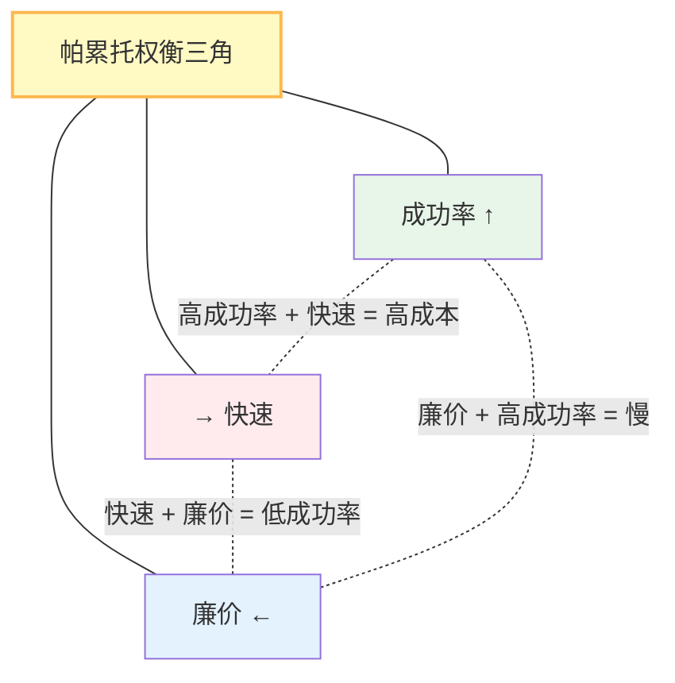

## 14.3 开放问题

即使有了成熟的框架、完善的评估、严格的安全防护，智能体系统仍面临深层的、可能需要多年研究才能解决的问题。

### 14.3.1 可靠性的理论上限

#### 问题陈述

给定一个LLM（能力有限），通过工具扩展能力。**最终的系统可靠性有上限吗？**

```python
可靠性 = P(正确完成任务)
        = P(LLM正确推理) × P(工具正确执行) × P(系统无故障)
        ≤ min(P(LLM推理), P(工具执行), P(系统稳定))
```

**当前现状**：

- Claude Sonnet 在 GAIA Level 1 成功率约 82%
- 在 Level 3 约 65%
- 随着推理步骤增加，成功率显著衰减

**理论问题**：

- 是否存在一个k，使得k步推理后成功率→0？
- 如何从根本上提升长链推理的可靠性？
- 或者，Agent应该避免长链推理，转为交互式设计？

#### 研究方向

可靠性研究框架的参考实现：

```python
class ReliabilityFramework:
    """可靠性研究框架"""

    @staticmethod
    def theoretical_analysis():
        """理论分析"""
        # 1. 建立可靠性的数学模型
        # 2. 证明在某些条件下的上下界
        # 3. 识别提升可靠性的关键点

        # 例：能否通过多数投票提升可靠性？
        single_agent_reliability = 0.6
        n_agents = 3
        from math import comb
        ensemble_reliability = sum(
            comb(3, k) * (0.6**k) * (0.4**(3-k))
            for k in range(2, 4)
        )  # 多数投票时的可靠性

        print(f"单Agent可靠性: {single_agent_reliability}")
        print(f"3-Agent集成: {ensemble_reliability}")

    @staticmethod
    def empirical_evaluation():
        """实证评估"""
        # 在GAIA基准上评估多步推理的可靠性衰减
        # 绘制"推理深度 vs 成功率"的曲线
        pass
```

### 14.3.2 长期记忆与目标保持

#### 问题陈述

现有Agent使用的上下文窗口虽已扩展至 200K-1M tokens(如 Claude Sonnet 4.6 支持 100 万 tokens)，但仍然是有限的短期窗口。**如何让智能体维持长期记忆并在多天/月的时间尺度上保持目标？**

#### 当前方案的局限

当前短期内存实现的局限性示例：

```python
# 当前方案：上下文管理
class ShortTermMemory:
    """短期上下文(当前实现)"""
    def __init__(self):
        self.context_window = 200_000  # tokens(当前主流模型窗口)
        self.history = []

    def add(self, item):
        self.history.append(item)
        # 当超出限制时，丢弃早期项
        if total_tokens() > self.context_window:
            self.history.pop(0)

# 问题：长期信息丢失，无法维持跨天的目标
```

#### 理想的长期记忆系统

代码示例如下：

```python
from dataclasses import dataclass
from datetime import datetime

@dataclass
class MemoryItem:
    content: str
    importance_score: float       # 1-10
    timestamp: datetime
    retrieval_count: int          # 被检索次数
    last_accessed: datetime
    relationships: List[str]      # 与其他记忆的关联

class LongTermMemorySystem:
    """长期记忆系统(理想版本)"""

    async def store(self, item: MemoryItem):
        """存储记忆"""
        # 1. 重要性评估：是否值得长期保留
        if item.importance_score > threshold:
            await self.long_term_store.save(item)

    async def retrieve(self, query: str) -> List[MemoryItem]:
        """检索相关记忆"""
        # 1. 向量相似性搜索
        # 2. 时间衰减：距今越近的记忆权重越高
        # 3. 检索频率：常被访问的记忆优先

        decay_factor = exp(-days_since_access / half_life)
        recency_score = item.retrieval_count * decay_factor

        return sorted_by(recency_score)

    async def consolidate(self):
        """记忆巩固(类似睡眠)"""
        # 周期性地对记忆进行：
        # 1. 去重(移除冗余记忆)
        # 2. 总结(将相关记忆聚类摘要)
        # 3. 关联(找出跨时间的因果关系)
        pass

    async def maintain_goal(self, goal: str):
        """维持长期目标"""
        # 定期检查：目标是否仍然相关
        # 更新：中间里程碑的进展
        # 适应：根据新信息调整目标

        current_state = await self.assess_goal_progress(goal)
        if current_state.progress_stalled:
            # 重新规划
            new_plan = await self.replan(goal)
        elif current_state.environment_changed:
            # 适应新环境
            await self.adapt(goal, current_state)
```

#### 技术挑战

1. **存储成本**：长期记忆的向量化和检索成本
2. **一致性**：多智能体系统中的记忆一致性
3. **遗忘**：何时有意遗忘，以防止记忆过载
4. **隐私**：长期存储敏感信息的风险

### 14.3.3 涌现行为与控制

#### 问题陈述

当多个智能体交互时，**整个系统可能出现非预期的涌现行为**(Emergent Behavior)。

#### 案例：多智能体竞争

示例如下：

```python
class EmergentBehaviorExample:
    """涌现行为案例"""

    async def scenario_auction():
        """竞拍场景中的涌现行为"""

        # 初始设计：每个Agent独立报价，最高价获胜
        agents = [BiddingAgent(budget=1000) for _ in range(3)]

        # 预期：平均成交价~500-600
        # 实际：可能出现以下涌现行为
        # 1. 恶性竞争：价格螺旋上升到1000+(超过价值)
        # 2. 串谋：多个Agent协调压价
        # 3. 市场操纵：一个强Agent驱逐其他竞争者

        final_price = await conduct_auction(agents, item_value=500)

        # 系统无法预测final_price具体是多少
```

#### 解决方向

方案如下：

```python
class EmergentBehaviorControl:
    """涌现行为控制"""

    @staticmethod
    def mechanism_design():
        """机制设计"""
        # 不是事后修复涌现行为，而是事前设计机制
        # 使得个体最优 = 系统最优(激励兼容)

        # 例：Vickrey竞拍(次高价机制)
        # 激励诚实竞价，防止恶性竞争
        pass

    @staticmethod
    async def runtime_monitoring():
        """运行时监控与干预"""

        while True:
            # 监控系统行为指标
            metrics = await measure_system()

            # 检测异常
            if metrics.price_volatility > threshold:
                # 触发干预：临时暂停、改变规则等
                await system.intervene("high_volatility_detected")

    @staticmethod
    def formal_verification():
        """形式化验证"""
        # 使用模型检验等形式化方法
        # 证明在某些条件下不会出现特定涌现行为
        pass
```

### 14.3.4 智能体安全的攻防升级

#### 问题陈述

随着智能体能力提升，**安全防护需要持续进化**。攻击者可能：

1. **发现新的Harness漏洞**

   - 当前的路径校验可能被新编码方式绕过
   - 新的危险命令组合出现

2. **提示注入进化**

   ```text
   当前：直接指令注入
   未来：隐藏的指令（隐写术）、多语言混淆、偶然触发等
   ```

3. **工具链攻击**

   ```text
   当前：单个工具滥用
   未来：跨工具协调，利用工具间的隐含依赖
   ```

#### 防守策略的展望

框架示例如下：

```python
class AdaptiveSecurityFramework:
    """自适应安全框架"""

    async def red_team_simulation(self):
        """红队模拟"""
        # 定期用对抗性示例测试系统
        # 发现新的攻击方式

        adversarial_cases = [
            "新的编码方式",
            "符号链接变体",
            "权限提升新向量",
            "提示注入变体"
        ]

        for case in adversarial_cases:
            result = await test_defenses(case)
            if result.bypassed:
                # 更新防护
                await update_guardrails(case)

    async def zero_knowledge_verification(self):
        """零知识验证"""
        # 验证工具输出的有效性，无需信任工具
        # 例：验证计算正确性而不重新计算

        tool_output = await tool.execute()
        verified = await zkproof.verify(tool_output)

        if not verified:
            raise SecurityError("Tool output failed ZK verification")
```

### 14.3.5 成本效率的帕累托前沿

#### 问题陈述

**成功率、响应时间、成本之间无法同时优化**，存在帕累托权衡。



#### 权衡问题

示例代码如下：

```python
class ParetoFrontier:
    """成本效率的帕累托前沿"""

    @staticmethod
    def characterize_frontier():
        """描述帕累托前沿"""

        scenarios = [
            {
                "name": "低成本",
                "model": "Llama 4 Scout",
                "success_rate": 0.70,
                "cost_per_task": 0.001,
                "latency_sec": 3.0
            },
            {
                "name": "均衡",
                "model": "Claude Haiku 4.5",
                "success_rate": 0.85,
                "cost_per_task": 0.01,
                "latency_sec": 2.0
            },
            {
                "name": "高精度",
                "model": "Claude Sonnet 4.6",
                "success_rate": 0.93,
                "cost_per_task": 0.05,
                "latency_sec": 5.0
            }
        ]

        # 问题：如何选择？
        # 答案：取决于业务KPI(容忍的成本/延迟/准确度权衡)

        return scenarios

    @staticmethod
    async def adaptive_routing():
        """自适应路由"""
        # 根据任务特征和系统状态，动态选择最优模型

        for task in incoming_tasks:
            # 1. 估计任务难度
            difficulty = await estimate_difficulty(task)

            # 2. 选择合适的模型
            if difficulty == "easy":
                model = "Llama 4 Scout"  # 廉价
            elif difficulty == "medium":
                model = "Claude Haiku 4.5"  # 均衡
            else:
                model = "Claude Sonnet 4.6"  # 精确

            result = await run_with_model(task, model)
```

---

**本节总结**：这些开放问题代表了Agent工程的科学边界。解决它们需要跨越工程、数学、经济学的多学科合作，可能需要十年或更长时间。但正是这些挑战驱动了该领域的创新和进步。
