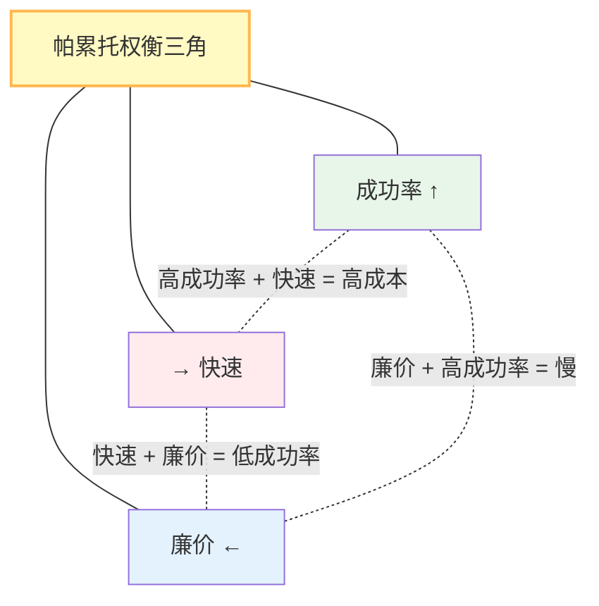

## 14.3 开放问题

即使有了成熟的框架、完善的评估、严格的安全防护，智能体系统仍面临深层的、可能需要多年研究才能解决的问题。

本节讨论六大开放问题：可靠性的理论上限、长期记忆与目标保持、多智能体系统的涌现行为控制、智能体安全的攻防升级、成本效率与性能的帕累托权衡、以及 Harness 假设过时的困境。

### 14.3.1 可靠性的理论上限

#### 可靠性问题陈述

给定一个LLM（能力有限），通过工具扩展能力。 **最终的系统可靠性有上限吗？**

```text
可靠性 = P(正确完成任务)
        = P(LLM正确推理) × P(工具正确执行) × P(系统无故障)
        ≤ min(P(LLM推理), P(工具执行), P(系统稳定))
```

**当前现状**：

- 多步推理和工具链越长，错误累积越明显
- 同一系统在简单任务和复杂任务上的可靠性差距可能很大
- 公开排行榜数据变化较快，具体数字应以基准官网和模型供应商当前报告为准

**理论问题**：

- 是否存在一个k，使得k步推理后成功率→0？
- 如何从根本上提升长链推理的可靠性？
- 或者，Agent应该避免长链推理，转为交互式设计？

#### 研究方向

可靠性研究框架的参考实现：

```python
class ReliabilityFramework:
    """可靠性研究框架"""

    @staticmethod
    def theoretical_analysis():
        """理论分析"""
        # 1. 建立可靠性的数学模型
        # 2. 证明在某些条件下的上下界
        # 3. 识别提升可靠性的关键点

        # 例:能否通过多数投票提升可靠性？
        single_agent_reliability = 0.6
        n_agents = 3
        from math import comb
        ensemble_reliability = sum(
            comb(3, k) * (0.6**k) * (0.4**(3-k))
            for k in range(2, 4)
        )  # 多数投票时的可靠性

        print(f"单Agent可靠性: {single_agent_reliability}")
        print(f"3-Agent集成: {ensemble_reliability}")

    @staticmethod
    def empirical_evaluation():
        """实证评估"""
        # 在GAIA基准上评估多步推理的可靠性衰减
        # 绘制"推理深度 vs 成功率"的曲线
        pass
```

### 14.3.2 长期记忆与目标保持

#### 长期记忆问题陈述

现有 Agent 使用的上下文窗口虽已显著扩展，但仍然是有限的短期窗口；不同模型、账号权限和供应商界面的上限需要按官方模型目录确认。 **如何让智能体维持长期记忆并在多天/月的时间尺度上保持目标？**

#### 当前方案的局限

当前短期内存实现的局限性示例：

```python
# 当前方案:上下文管理
class ShortTermMemory:
    """短期上下文(当前实现)"""
    def __init__(self):
        self.context_window = 200_000  # 示例值；按实际模型可调到 1_000_000
        self.history = []

    def add(self, item):
        self.history.append(item)
        # 当超出限制时,丢弃早期项
        if total_tokens() > self.context_window:
            self.history.pop(0)

# 问题:长期信息丢失,无法维持跨天的目标
```

#### 理想的长期记忆系统

代码示例如下：

```python
from dataclasses import dataclass
from datetime import datetime

@dataclass
class MemoryItem:
    content: str
    importance_score: float       # 1-10
    timestamp: datetime
    retrieval_count: int          # 被检索次数
    last_accessed: datetime
    relationships: List[str]      # 与其他记忆的关联

class LongTermMemorySystem:
    """长期记忆系统(理想版本)"""

    async def store(self, item: MemoryItem):
        """存储记忆"""
        # 1. 重要性评估:是否值得长期保留
        if item.importance_score > threshold:
            await self.long_term_store.save(item)

    async def retrieve(self, query: str) -> List[MemoryItem]:
        """检索相关记忆"""
        # 1. 向量相似性搜索
        # 2. 时间衰减:距今越近的记忆权重越高
        # 3. 检索频率:常被访问的记忆优先

        decay_factor = exp(-days_since_access / half_life)
        recency_score = item.retrieval_count * decay_factor

        return sorted_by(recency_score)

    async def consolidate(self):
        """记忆整合(类似睡眠)"""
        # 周期性地对记忆进行:
        # 1. 去重(移除冗余记忆)
        # 2. 总结(将相关记忆聚类摘要)
        # 3. 关联(找出跨时间的因果关系)
        pass

    async def maintain_goal(self, goal: str):
        """维持长期目标"""
        # 定期检查:目标是否仍然相关
        # 更新:中间里程碑的进展
        # 适应:根据新信息调整目标

        current_state = await self.assess_goal_progress(goal)
        if current_state.progress_stalled:
            # 重新规划
            new_plan = await self.replan(goal)
        elif current_state.environment_changed:
            # 适应新环境
            await self.adapt(goal, current_state)
```

#### 技术挑战

1. **存储成本**：长期记忆的向量化和检索成本
2. **一致性**：多智能体系统中的记忆一致性
3. **遗忘**：何时有意遗忘，以防止记忆过载
4. **隐私**：长期存储敏感信息的风险

### 14.3.3 涌现行为与控制

#### 涌现行为问题陈述

当多个智能体交互时， **整个系统可能出现非预期的涌现行为** (Emergent Behavior)。

#### 案例：多智能体竞争

示例如下：

```python
class EmergentBehaviorExample:
    """涌现行为案例"""

    async def scenario_auction():
        """竞拍场景中的涌现行为"""

        # 初始设计:每个Agent独立报价,最高价获胜
        agents = [BiddingAgent(budget=1000) for _ in range(3)]

        # 预期:平均成交价~500-600
        # 实际:可能出现以下涌现行为
        # 1. 恶性竞争:价格螺旋上升到1000+(超过价值)
        # 2. 串谋:多个Agent协调压价
        # 3. 市场操纵:一个强Agent驱逐其他竞争者

        final_price = await conduct_auction(agents, item_value=500)

        # 系统无法预测final_price具体是多少
```

#### 解决方向

方案如下：

```python
class EmergentBehaviorControl:
    """涌现行为控制"""

    @staticmethod
    def mechanism_design():
        """机制设计"""
        # 不是事后修复涌现行为,而是事前设计机制
        # 使得个体最优 = 系统最优(激励兼容)

        # 例:Vickrey竞拍(次高价机制)
        # 激励诚实竞价,防止恶性竞争
        pass

    @staticmethod
    async def runtime_monitoring():
        """运行时监控与干预"""

        while True:
            # 监控系统行为指标
            metrics = await measure_system()

            # 检测异常
            if metrics.price_volatility > threshold:
                # 触发干预:临时暂停、改变规则等
                await system.intervene("high_volatility_detected")

    @staticmethod
    def formal_verification():
        """形式化验证"""
        # 使用模型检验等形式化方法
        # 证明在某些条件下不会出现特定涌现行为
        pass
```

### 14.3.4 智能体安全的攻防升级

#### 安全攻防问题陈述

随着智能体能力提升， **安全防护需要持续进化**。攻击者可能：

1. **发现新的Harness漏洞**

   - 当前的路径校验可能被新编码方式绕过
   - 新的危险命令组合出现

2. **提示注入进化**

   ```text
   当前:直接指令注入
   未来:隐藏的指令(隐写术)、多语言混淆、偶然触发等
   ```

3. **工具链攻击**

   ```text
   当前:单个工具滥用
   未来:跨工具协调,利用工具间的隐含依赖
   ```

#### 防守策略的展望

框架示例如下：

```python
class AdaptiveSecurityFramework:
    """自适应安全框架"""

    async def red_team_simulation(self):
        """红队模拟"""
        # 定期用对抗性示例测试系统
        # 发现新的攻击方式

        adversarial_cases = [
            "新的编码方式",
            "符号链接变体",
            "权限提升新向量",
            "提示注入变体"
        ]

        for case in adversarial_cases:
            result = await test_defenses(case)
            if result.bypassed:
                # 更新防护
                await update_guardrails(case)

    async def zero_knowledge_verification(self):
        """零知识验证"""
        # 验证工具输出的有效性,无需信任工具
        # 例:验证计算正确性而不重新计算

        tool_output = await tool.execute()
        verified = await zkproof.verify(tool_output)

        if not verified:
            raise SecurityError("Tool output failed ZK verification")
```

### 14.3.5 成本效率的帕累托前沿

#### 成本效率问题陈述

**成功率、响应时间、成本之间无法同时优化**，存在帕累托权衡。



#### 权衡问题

示例代码如下：

```python
class ParetoFrontier:
    """成本效率的帕累托前沿"""

    @staticmethod
    def characterize_frontier():
        """描述帕累托前沿"""

        scenarios = [
            {
                "name": "低成本",
                "model": "Llama 4 Scout",
                "success_rate": 0.70,
                "cost_per_task": 0.001,
                "latency_sec": 3.0
            },
            {
                "name": "均衡",
                "model": "Claude Haiku 4.5",
                "success_rate": 0.85,
                "cost_per_task": 0.01,
                "latency_sec": 2.0
            },
            {
                "name": "高精度",
                "model": "Claude Sonnet 4.6",
                "success_rate": 0.93,
                "cost_per_task": 0.05,
                "latency_sec": 5.0
            }
        ]

        # 问题:如何选择？
        # 答案:取决于业务KPI(容忍的成本/延迟/准确度权衡)

        return scenarios

    @staticmethod
    async def adaptive_routing():
        """自适应路由"""
        # 根据任务特征和系统状态,动态选择最优模型

        for task in incoming_tasks:
            # 1. 估计任务难度
            difficulty = await estimate_difficulty(task)

            # 2. 选择合适的模型
            if difficulty == "easy":
                model = "Llama 4 Scout"  # 廉价
            elif difficulty == "medium":
                model = "Claude Haiku 4.5"  # 均衡
            else:
                model = "Claude Sonnet 4.6"  # 精确

            result = await run_with_model(task, model)
```

### 14.3.6 Harness-as-Assumption 困境：何时该简化

#### 问题陈述

本书前 13 章一直在讲 **如何往 Harness 里加东西**——加沙箱、加 guardrail、加重试、加压缩、加审计。但有一个反向问题同样关键： **什么时候该把已经加进去的东西拿掉？**

每一个 Harness 组件——每一次工具重试、每一段上下文压缩、每一道权限护栏、每一个结构化输出校验——本质上都在编码一个隐含假设： **“模型自己做不到这件事，所以基础设施必须替它兜底。”**

这个观察被 Anthropic 在 2026 年的 [Harness design for long-running application development](https://www.anthropic.com/engineering/harness-design-long-running-apps) 一文中明确化：

> "every component in a harness encodes an assumption about what the model can't do on its own, and those assumptions are worth stress testing."

随着模型能力快速演进，这些被编码的假设会过期。一个为弱模型设计的 Harness，在强模型上会变成 **不必要的开销、延迟和复杂度**——更糟的是，它甚至可能限制强模型本来能做到的事。

#### 案例：Anthropic 的 sprint construct 移除

Anthropic 给出了一个具体案例：

- **Opus 4.5 时代**：为了防止 agent 在长任务中“过度自我表扬”，引入了 sprint construct（把长任务切成 sprint，每个 sprint 末尾用独立 evaluator 验证）
- **升级到 Opus 4.6**：原文判断“模型的原生能力已有充分理由相信不再需要这种分解”，于是移除了该组件
- **移除后的 V2 驭具**：在另一项同等复杂度的应用构建任务（DAW 音乐工作站）上用时约 3 小时 50 分、成本约 **\$125**；作为对照，完整驭具 + Opus 4.5 构建复古游戏编辑器用时 6 小时、成本约 **\$200**。注意两次运行的任务与模型都不同，降幅不能单独归因于移除 sprint construct——但它体现了“随模型变强而精简驭具”带来的开销下降

如果没有人主动审视这个组件是否仍然必要，团队会持续为一个已经无效的假设付钱。

#### 为什么是一个未解的开放问题

简化听起来是常识，但实践中难做到：

1. **缺少“哪个假设还有效”的可观测信号**：移除一个 Harness 组件需要确认它的失败率在新模型下足够低。但 Harness 的失败被 Harness 自己吸收掉了——guardrail 拦下的注入、retry 救回的瞬时失败、validator 挡下的格式错——这些都不会在常规 metric 里出现，因而无法直接看到“已经多久没救场了”
2. **复合效应难以解耦**：A 组件的简化可能让 B 组件的负载上升。需要 factorial（模型 × Harness 配置）实验，运行成本高
3. **长尾回归风险**：移除一个 guardrail 后，新模型在 99% 任务上 OK，但 1% 长尾任务上发生严重失败，单次代价可能远大于保留 guardrail 的固定开销
4. **组织惯性**：Harness 通常是多个团队、多次事故后的层层堆积，很少有人能完整说出“为什么这一段还在”

#### 研究方向

```python
class HarnessAssumptionAudit:
    """Harness 假设有效性的审计框架"""

    async def shadow_ablation(self, component_to_remove, n_tasks=1000):
        """影子实验:在生产流量上并行运行 baseline 与 ablated 版本"""
        baseline = await run(full_harness, tasks)
        ablated = await run(
            harness.without(component_to_remove),
            tasks
        )

        return {
            "success_delta_pp": ablated.success - baseline.success,
            "cost_delta_pct": (ablated.cost - baseline.cost) / baseline.cost,
            "long_tail_failure_rate": ablated.tail_failures,
            # load_bearing_score 接近 0 → 该组件已可移除
            "load_bearing_score": baseline.success - ablated.success,
        }

    async def factorial_evaluation(self, models, harness_configs):
        """因子化评估:识别哪些干预是'模型相关'的"""
        # 一些 Harness 组件对所有模型都有效 → 应保留
        # 一些组件只对弱模型有效 → 强模型升级时应移除
        # 一些组件反而损害强模型 → 应紧急移除
        ...

    async def meta_monitoring(self):
        """元监控:追踪'哪些 Harness 干预还在救场'"""
        # 对每个 guardrail/validator/retry, 记录:
        # - 多久没有触发过(组件可能已无效)
        # - 触发后挽救的失败类型(组件还在防御什么)
        # - 触发对成本的开销(组件是否值)
        ...
```

理想的 Harness 不是 **单调增长的脚手架**，而是 **持续自问“哪些控制还需要”的自适应系统**。学术综述 [Agent Harness Engineering: A Survey](https://openreview.net/pdf?id=eONq7FdiHa)（OpenReview Archive，2026-05）将这个问题列为五大长期开放问题之一，并提出“adaptive simplification”作为长期目标。这一方向与本书 14.2 节“标准化演进”互补——前者关注实现层的精简， **后者关注协议层的趋同**。

---

**本节总结**：这些开放问题代表了Agent工程的科学边界。解决它们需要跨越工程、数学、经济学的多学科合作，可能需要十年或更长时间。但正是这些挑战驱动了该领域的创新和进步。
