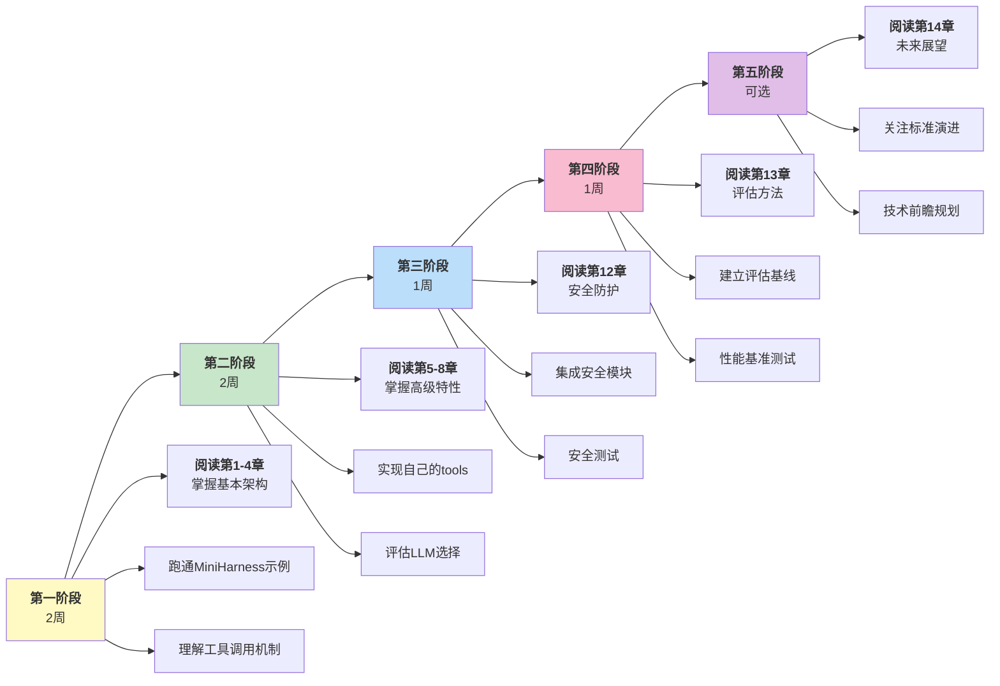

## 本章小结

本章展望了 Harness 工程的未来发展方向，以下是三条关键道路的阐述。

### 三条未来的道路

Harness 工程的未来不是单一方向，而是三条相互交织的道路：

#### 道路 1：智能体原生应用

**从** “AI 增强现有应用” **到** “应用由 Agent 构成”

**标志**：智能体即操作系统(Agent-as-OS)、多智能体协作、持久化自驱智能体

**工程影响**：

- 架构从 C/S 转为 Agent-OS
- 开发从过程式转为目标驱动式
- 测试从单元测试转为行为验证

**时间表（本书判断）**：若可靠性、成本和标准化继续推进，2026-2028 年将以小规模应用为主，2030 年代可能主流化

#### 道路 2：标准化演进

**从** “各框架各自为战” **到** “统一的生态”

**标志**：MCP 持续演进、NIST CAISI 标准、跨框架互操作

**工程影响**：

- 工具可复用（一次编写，多框架使用）
- 人员可流动（技能可迁移）
- 产业可协同（供应链形成）

**时间表**：2026 年 NIST 推进调研、工作坊和标准化协作；互操作性框架、合规要求和企业采用节奏仍以官方后续发布和行业验证为准

#### 道路 3：基础研究突破

**从** “启发式工程” **到** “理论驱动设计”

**标志**：可靠性理论、长期记忆机制、涌现控制

**工程影响**：

- 更智能的自适应系统
- 更可预测的行为
- 更高的鲁棒性

**时间表**：进行中，持续多年

### 工程师的决策指南

#### 当前阶段

**现在做什么**：

1. 深化当前框架的掌握（Claude Code、OpenClaw 等）
2. 实现完整的安全防护（第 12 章）
3. 建立评估基线（第 13 章）
4. 关注 MCP 规范演进，为适配做准备

**不要过早投入**：

- 多智能体系统（标准未定）
- 长期记忆系统（仍在研究）
- 智能体即操作系统(Agent-as-OS)实现（为时过早）

#### 中期方向

**积极探索**：

- MCP 新版本迁移
- 跟踪 NIST AI Agent 标准化倡议与自愿指南
- 多智能体协作原型
- 框架间互操作性

**投资重点**：

- 标准化工具库（未来易复用）
- 评估框架完善（未来易对标）
- 文档和培训（人员易流动）

#### 长期视野

**准备就绪**：

- 迎接 Agent-native 范式
- 参与标准制定
- 投资基础研究人才

### 反思：工程的本质

本书从架构、优化、安全、评估四个维度深入 Harness 系统。但在更高的层面，这些都是为了回答一个根本问题：

>**如何让 AI 系统可靠、安全、有效地扩展人类的能力？**

这不是纯技术问题，而是涉及设计哲学、伦理、经济学的综合问题：

- **设计**：Agent-OS 的架构应该如何演进？
- **伦理**：自主智能体的责任边界在哪里？
- **经济**：谁来为失败负责？谁收益？
- **社会**：Agent 工作的崛起如何影响就业？

### 给读者的建议

#### 对工程师

1. **打好基础**：掌握第 1-8 章的架构和交互原理
2. **追求深度**：选择一个维度（安全、性能、评估）深研
3. **保持学习**：每半年评估一次技术栈是否仍是最佳选择
4. **参与社区**：在 MCP、NIST 标准讨论中发出声音

#### 对技术管理者

1. **投资培训**：Agent 工程是新领域，需要系统培训
2. **建立标准**：参考本书的架构、安全、评估建议
3. **平衡创新与稳定**：不要过早追逐最新特性，但要为未来规划
4. **关注人才**：优秀的 Agent 工程师会越来越稀缺

#### 对企业领导

1. **认识价值**：本书判断，智能体系统将成为 2026 年及以后的重要竞争能力
2. **评估风险**：安全和可靠性不是可选的
3. **规划投资**：3-5 年的时间跨度考虑 Agent 策略
4. **拥抱开放**：支持标准化和生态建设，长期有利

### 结语

《智能体 Harness 工程指南》记录的是 Harness 工程刚刚站稳为一门独立工程学科的这个阶段。它的特征是：

- 大模型已经足够强大（Claude Opus 5 / Sonnet 5、GPT-5.6、Llama 4 等当代旗舰）
- Harness 框架已有可复用的早期成熟形态
- 生产应用已经足够支撑工程实践总结
- NIST 已正式启动 AI Agent 标准化，但标准仍在制定中
- 基础研究仍在早期

这是一个充满机遇的时刻。无论你是工程师、管理者、研究者还是企业决策者，都可以在这个浪潮中找到自己的位置和贡献。

下一个十年，Harness 工程将如何演进，取决于像你一样的从业者的选择和创新。

---

### 附加资源

#### 进阶阅读

- **论文**：GAIA, WebArena, SWE-Bench 原始论文
- **官方文档**：Anthropic SDK、Claude API、MCP 规范
- **开源项目**：LangChain、LlamaIndex、AutoGen

#### 社区

- NIST AI Agent 标准化工作组
- MCP 社区论坛
- Anthropic 开发者社区
- 国内 AI 工程学习社区

#### 建议的学习路径

推荐的学习路径和阶段划分如下：

---

**感谢阅读《智能体 Harness 工程指南》。现在，该是你用所学去构建下一代应用的时候了。**
