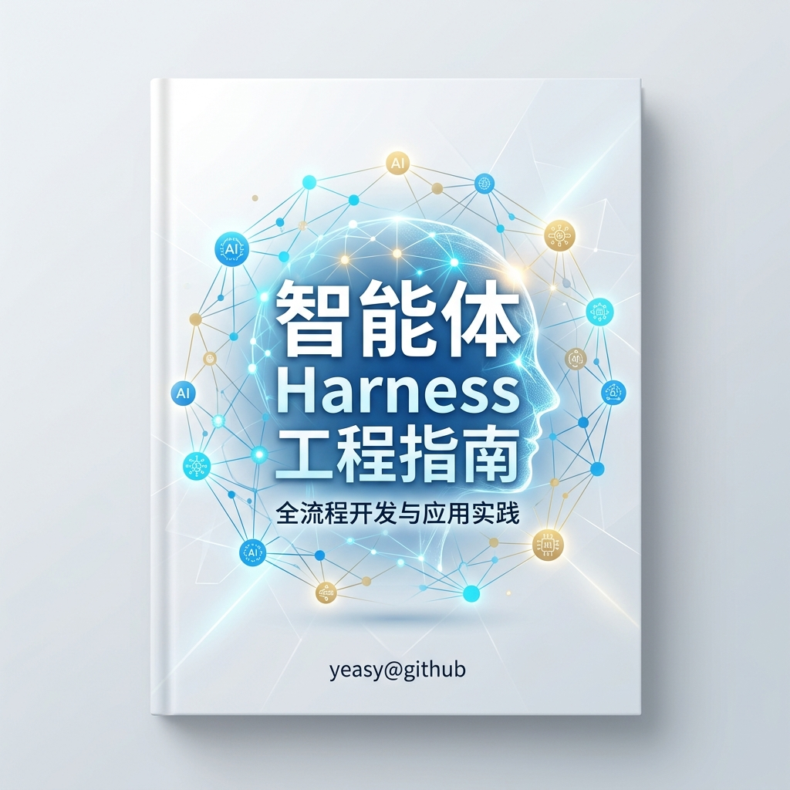
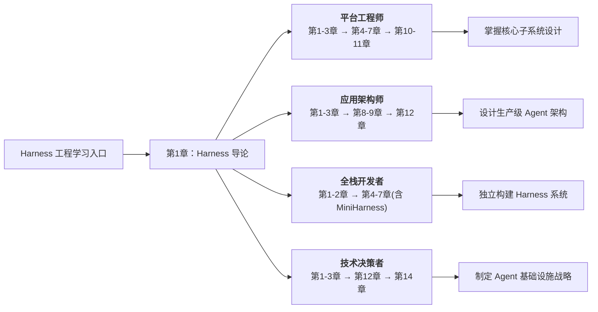

# 智能体 Harness 工程指南

> 智能体 = 大模型 + Harness。深入剖析 Harness 工程原理、设计、实现。



## 本书简介

2026 年初，业界逐渐形成共识：**决定智能体成败的，往往不是底层大模型的能力，而是包裹在模型外围的 Harness 系统**。

“Harness 工程”（Harness Engineering）这一概念开始进入主流视野。多个生产级智能体项目（Agent）的经验表明：模型不再是差异化因素，围绕模型构建的工程系统才是。

毫不夸张地说，**智能体 = 大模型 + Harness**。大模型提供推理的“大脑”，Harness 提供执行、记忆与安全保障的“身体”。验证循环、重试策略、状态管理、检查点恢复——这些 Harness 层的能力，决定了一个智能体系统能否从原型走向生产。软件工程社区开始系统化地探讨这一工程范式。

Harness 一词意为“驾驭”，原指骑手用以驾驭烈马的缰绳和鞍具系统——如同骑手通过缰绳和鞍具将烈马的奔腾之力化为可控的前行，Agent Harness 将大模型的推理能力转化为可靠、可控、可观测的生产级系统。它包含运行时引擎、工具层、记忆子系统、编排引擎、安全体系和可观测性基础设施等核心子系统。

本书不讲“Agent 是什么”——那是 [《智能体 AI 权威指南》](https://yeasy.gitbook.io/agentic_ai_guide) 的主题；不讲“上下文如何管理”——那是 [《大模型上下文工程权威指南》](https://yeasy.gitbook.io/context_engineering_guide) 的领域；也不讲“AI 安全攻防”——[《大模型安全权威指南》](https://yeasy.gitbook.io/ai_security_guide) 已有深入覆盖。本书只聚焦一个问题：**如何设计和构建驱动智能体的工程基础设施**。

## 三大参考系统

全书以三个具有代表性的生产级开源系统作为核心参考案例，贯穿始终：

**[OpenAI Codex](https://github.com/openai/codex)** 代表 **性能型智能体** 的 Harness 范式。它以 Rust 为核心语言（占比约 95%），通过系统级编程实现了高性能、内存安全的 Harness 架构。其特色包括：基于 Starlark 的执行策略引擎（execpolicy）、平台原生沙箱（Linux 上使用 Bubblewrap + seccomp，macOS 使用 sandbox-exec，Windows 使用 restricted-token）、skills/core-skills 技能模块体系、OpenTelemetry 原生可观测性（otel 模块），以及内置 MCP 服务端支持等。

**[Claude Code](https://github.com/anthropics/claude-code)** 代表 **任务型智能体** 的 Harness 范式。它围绕终端交互场景构建了一套精密的工程系统，约 50 万行 TypeScript 代码实现了完整的 Harness 架构。其特色包括：基于异步生成器的 Agent 循环引擎（QueryEngine）、24+内置工具的类型安全注册体系、分层权限系统（含 ML 自动审批）、autoDream 记忆整合引擎、40+ 编译时特性门控、以及 Coordinator 多智能体编排模式等。

**[OpenClaw](https://github.com/openclaw/openclaw)** 代表 **自驱型智能体** 的 Harness 范式。它通过 Gateway 控制平面、Heartbeat 心跳机制和多渠道接入层，实现了无需用户持续指令即可自主运行的 Agent 架构。其 Harness 特色包括：基于 WebSocket 的 Gateway 协议、三级权限模型（Free/Ask-first/Approve-once）、MEMORY.md + 每日记忆的双层记忆体系、Lobster 确定性工作流引擎，以及 ClawHub 技能注册中心等。更多内容可参考 [《OpenClaw 从入门到精通》](https://yeasy.gitbook.io/openclaw_guide)。

这三个系统分别展示了 Harness 工程在不同场景和技术路线下的设计取舍：

| 维度 | Codex（性能型） | Claude Code（任务型） | OpenClaw（自驱型） |
|------|--------------------|-----------------------|--------------------|
| 核心语言 | Rust（~95%） | TypeScript（~50万行） | TypeScript |
| 触发方式 | 用户指令驱动 | 用户指令驱动 | Heartbeat 自主唤醒 + 定时任务 |
| 运行模式 | 按需启动、完成即停 | 按需启动、完成即停 | 持续后台运行 |
| 工具生态 | skills + core-skills 模块 + MCP | 24+ 内置工具 + MCP 扩展 | ClawHub 技能注册中心（13000+预构建skills） |
| 记忆模型 | state 模块会话管理 | autoDream 自动整合 | MEMORY.md + 每日日志 |
| 安全模型 | execpolicy 策略引擎（allow/prompt/forbidden） | 风险分级 + ML 自动审批 | 三级权限（Free/Ask/Approve） |
| 沙箱实现 | 平台原生沙箱（Bubblewrap/seccomp/Landlock） | 进程级隔离 | 容器级隔离 |
| 多智能体 | 分层 Agent 消息协议 | Coordinator 模式 + 子 Agent | Lobster 工作流引擎 |
| 可观测性 | OpenTelemetry 原生集成 | 内置结构化日志 | 每日记忆日志 |

## 实战项目：MiniHarness

全书贯穿一个从零构建的实战项目——**MiniHarness**，一个最小但完整的 Agent Harness 系统，使用 **Python** 实现。

MiniHarness 从第一章介绍、第二章搭建脚手架开始，每章在前一章的基础上逐步添加子系统：运行时引擎 → 工具层 → 记忆子系统 → 输出治理 → 编排引擎 → MCP 集成 → 生产化加固 → 可靠性保障 → 安全层 → 测试验收。全书读完，读者将拥有一个包含所有核心子系统的可运行 Harness。

## 目标读者

本书面向已具备 AI Agent 基本概念、希望深入工程实现的技术读者：

- **Agent 平台工程师**：正在构建或维护 Agent 运行平台，需要掌握运行时引擎、工具层、安全子系统等核心模块的设计方法。
- **AI 应用架构师**：需要评估和选型 Harness 框架，设计可靠的 Agent 系统架构。
- **全栈开发者**：希望理解自己使用的 Agent 框架“引擎盖下”到底发生了什么，从而更好地排查问题和优化性能。
- **技术决策者**：需要理解 Harness 工程的核心权衡，制定 Agent 基础设施的技术战略。

读者应具备 Python 编程经验，并对大语言模型和 AI Agent 有基本了解。如需补充 Agent 基础知识，推荐先阅读 [《智能体 AI 权威指南》](https://yeasy.gitbook.io/agentic_ai_guide)。

## 学习路线图

根据不同的角色和学习目标，以下路线图为你展示了最优的章节阅读顺序：



| 读者角色 | 学习重点 | 核心成果 |
|---------|---------|---------|
| **Agent 平台工程师** | 第1-3章 → 第4-7章 → 第10-11章 | 掌握运行时、工具层、记忆、安全等核心子系统的设计与实现 |
| **AI 应用架构师** | 第1-3章 → 第8-9章 → 第12章 | 设计可靠的多智能体编排架构与 MCP 集成方案 |
| **全栈开发者** | 第1-2章 → 第4-7章（含 MiniHarness） | 通过实战项目独立构建包含所有核心子系统的 Harness |
| **技术决策者** | 第1-3章 → 第12章 → 第14章 | 理解 Harness 核心权衡，制定 Agent 基础设施技术战略 |

## 阅读方式

### 在线阅读

👉 **推荐**：[GitBook 在线版](https://yeasy.gitbook.io/harness_engineering_guide/)

### 下载离线版本

本书提供 PDF 版本供离线阅读，可前往 [GitHub Releases](https://github.com/yeasy/harness_engineering_guide/releases/latest) 页面下载最新版本。

如需获取默认分支自动更新的预览版，可直接下载 [harness_engineering_guide.pdf](https://github.com/yeasy/harness_engineering_guide/releases/download/preview-pdf/harness_engineering_guide.pdf)。该文件会随主线更新覆盖，不代表正式发布版本。

### 本地阅读

先安装 [mdPress](https://github.com/yeasy/mdpress)：

```bash
brew tap yeasy/tap && brew install mdpress
mdpress serve
```

启动后访问 [本地阅读地址](http://localhost:9000) 即可阅读。

## 你将学到什么

阅读本书后，你将具备设计和构建生产级 Agent Harness 系统的完整能力：

- 理解 Harness 工程的设计哲学与四大核心原则（约束优先、可验证性、渐进信任、故障假设）
- 掌握运行时引擎的实现：Agent 循环、消息流、流式处理、错误恢复和漂移纠正
- 设计高效可靠的工具层：工具抽象、执行流水线、动态发现与权限控制
- 构建记忆与上下文子系统：多层记忆架构、上下文组装引擎和自动化记忆整合
- 设计模型集成与输出治理层：模型抽象、结构化输出校验、幻觉检测机制
- 构建任务编排系统：状态机、工作流引擎、多智能体编排与通信协议
- 深入理解 MCP 协议架构，掌握在 Harness 中集成 MCP 的工程模式
- 构建容错与可靠性体系：可观测性、反馈循环、容错模式和幻觉防护
- 设计 Harness 安全体系：权限系统、沙箱隔离、工具调用护栏和路径校验
- 独立完成一个包含所有核心子系统的完整 Harness 实现（MiniHarness 项目）

## 全书结构

全书分为四个部分，共 14 章。

**第一部分：Harness 工程基础**（第 1-3 章）用一节篇幅回顾 Agent 背景后，立即切入 Harness 工程的定义、参考架构全景和四大设计原则，并介绍贯穿全书的实战项目 MiniHarness。

**第二部分：Harness 核心子系统**（第 4-7 章）逐一拆解 Harness 的四大引擎——运行时、工具层、记忆子系统、模型集成与输出治理。每章围绕“如何设计和构建这个子系统”展开，结合 Codex、Claude Code 和 OpenClaw 的真实实现进行剖析，并在 MiniHarness 中动手实现。

**第三部分：系统集成与工程实践**（第 8-11 章）从子系统上升到系统层面：任务编排与工作流引擎、MCP 协议集成、生产级 Harness 构建（提示词工程、插件体系、性能优化、特性门控），以及容错与可靠性工程。

**第四部分：安全、评估与演进**（第 12-14 章）覆盖 Harness 系统的安全体系设计、评估与质量保障方法论，最后展望 Harness 工程的未来演进方向。

## 与系列图书的关系

本书是 AI 工程系列图书之一，与其他图书形成互补：

| 图书 | 聚焦层次 | 核心问题 |
|------|---------|---------|
| [零基础学 AI](https://yeasy.gitbook.io/ai_beginner_guide) | 概念层 | AI 是什么、怎么用 |
| [大模型提示词工程指南](https://yeasy.gitbook.io/prompt_engineering_guide) | 交互层 | 如何与大模型高效对话 |
| [大模型上下文工程权威指南](https://yeasy.gitbook.io/context_engineering_guide) | 技术层 | 如何管理 LLM 的上下文 |
| [智能体 AI 权威指南](https://yeasy.gitbook.io/agentic_ai_guide) | 理论层 | Agent 的范式、推理、记忆与协作 |
| [Claude 技术指南](https://yeasy.gitbook.io/claude_guide) | 产品层 | Claude 生态的全面使用 |
| [大模型安全权威指南](https://yeasy.gitbook.io/ai_security_guide) | 安全层 | AI 系统的攻防与合规 |
| [大模型原理与架构](https://yeasy.gitbook.io/llm_internals) | 原理层 | 大语言模型底层逻辑与架构 |
| [OpenClaw 从入门到精通](https://yeasy.gitbook.io/openclaw_guide) | 实践层 | OpenClaw 的部署与使用 |
|**本书：Harness 工程**|**基础设施层**|**如何构建驱动 Agent 的工程系统**|

## 参与贡献

欢迎贡献！您可以通过以下方式参与：

- 🐛 [提交 Issue](https://github.com/yeasy/harness_engineering_guide/issues) — 报告错误或提出建议
- 📝 [提交 PR](https://github.com/yeasy/harness_engineering_guide/pulls) — 改进内容或修复 typo
- ⭐ Star 本项目 — 帮助更多人发现这本书

## 约定

- **代码示例** 使用 Python，实战项目 MiniHarness 为完整的 Python 实现。
- **参考实现** 主要引用 Codex（Rust）、Claude Code（TypeScript）和 OpenClaw（TypeScript/Gateway 架构）的源码，用于说明生产级系统的设计决策。
- **术语处理**：非常见术语首次出现时给出中英文对照和解释，后续直接使用。
- **架构图**：使用 Mermaid 绘制，辅以文字说明，便于理解和复现。
- **交叉引用**：涉及其他图书已深入覆盖的主题时，给出引用链接而非重复讲解。

---

*本书基于 2026 年 4 月的技术现状编写。AI Agent 领域演进迅速，建议读者结合最新官方文档和社区动态来阅读。*

## 许可证

本书采用 [CC BY-NC-SA 4.0](https://creativecommons.org/licenses/by-nc-sa/4.0/) 许可证。

您可以自由分享和演绎，但需署名、非商业使用、相同方式共享。
