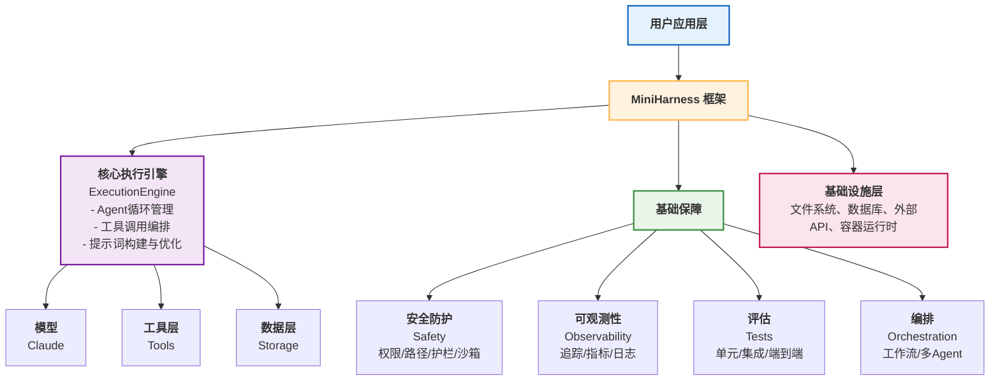

## 附录 D：MiniHarness 架构与代码

MiniHarness是本书示例系统，通过完整的代码实现展示Harness框架的核心设计原理。

### 项目概览

[MiniHarness](../lab/README.md)是本书示例系统，展示了一个完整的Harness框架。从架构、工具调用、优化、安全、评估等全方位覆盖。

#### 项目目标

通过MiniHarness，读者可以：

1. 理解Harness系统的完整架构
2. 学习安全防护的具体实现
3. 掌握评估框架的搭建
4. 在此基础上构建生产级系统

#### 项目特性

- ✅ 完整的工具调用框架
- ✅ 多层安全防护（权限、路径校验、护栏）
- ✅ 沙箱隔离支持
- ✅ 全面的评估系统
- ✅ 生产级监控和日志
- ✅ 完整的测试套件

### 目录结构

MiniHarness项目的完整目录结构：

```mermaid
graph TD
    A["harness_engineering_guide/"]

    A --> B["lab/"]

    B --> B1["<b>pyproject.toml</b><br/>项目配置"]
    B --> B2["<b>README.md</b><br/>项目说明"]

    B --> B3["<b>mini_harness/</b><br/>主包"]

    B3 --> B3a["__init__.py"]

    B3 --> C1["<b>core/</b><br/>核心模块第2章"]
    C1 --> C1a["__init__.py"]
    C1 --> C1b["message.py"]
    C1 --> C1c["tool.py"]
    C1 --> C1d["agent.py"]
    C1 --> C1e["event.py"]

    B3 --> C2["<b>runtime/</b><br/>运行时模块第4章"]
    C2 --> C2a["__init__.py"]
    C2 --> C2b["engine.py"]
    C2 --> C2c["models.py"]
    C2 --> C2d["events.py"]

    B3 --> C3["<b>tools/</b><br/>工具层第5章"]
    C3 --> C3a["__init__.py"]
    C3 --> C3b["registry.py"]
    C3 --> C3c["builtin.py"]
    C3 --> C3d["bash_tool.py"]
    C3 --> C3e["file_tool.py"]
    C3 --> C3f["web_tool.py"]

    B3 --> C4["<b>memory/</b><br/>记忆层第6章"]
    C4 --> C4a["__init__.py"]
    C4 --> C4b["storage.py"]
    C4 --> C4c["context.py"]
    C4 --> C4d["consolidation.py"]

    B3 --> C5["<b>models/</b><br/>模型层第7章"]
    C5 --> C5a["__init__.py"]
    C5 --> C5b["provider.py"]
    C5 --> C5c["parser.py"]
    C5 --> C5d["quality.py"]

    B3 --> C6["<b>orchestration/</b><br/>编排层第8章"]
    C6 --> C6a["__init__.py"]
    C6 --> C6b["engine.py"]

    B3 --> C7["<b>mcp/</b><br/>MCP集成第9章"]
    C7 --> C7a["__init__.py"]
    C7 --> C7b["integration.py"]

    B3 --> C8["<b>reliability/</b><br/>可观测性和可靠性第11章"]
    C8 --> C8a["__init__.py"]
    C8 --> C8b["tracing.py"]
    C8 --> C8c["monitoring.py"]
    C8 --> C8d["logging.py"]
    C8 --> C8e["resilience.py"]

    B3 --> C9["<b>security/</b><br/>安全防护第12章"]
    C9 --> C9a["__init__.py"]
    C9 --> C9b["permissions.py"]
    C9 --> C9c["path_validator.py"]
    C9 --> C9d["guardrails.py"]
    C9 --> C9e["secure_executor.py"]

    B3 --> C10["<b>utils/</b><br/>工具函数第10章"]
    C10 --> C10a["__init__.py"]
    C10 --> C10b["config.py"]
    C10 --> C10c["logging.py"]
    C10 --> C10d["error_handling.py"]

    B --> D["<b>examples/</b><br/>使用示例"]
    D --> D1["01_basic_agent.py"]
    D --> D2["02_file_analysis.py"]
    D --> D3["03_secure_execution.py"]
    D --> D4["04_e2e_test.py"]
    D --> D5["05_monitoring.py"]

    B --> E["<b>tests/</b><br/>测试套件第13章"]
    E --> E1["conftest.py"]
    E --> E2["test_unit.py"]
    E --> E3["test_integration.py"]
    E --> E4["test_e2e.py"]
    E --> E5["test_security.py"]
    E --> E6["test_performance.py"]
    E --> E7["fixtures/"]
    E7 --> E7a["sample_data/"]
    E7 --> E7b["mock_llm.py"]

    style A fill:#e3f2fd
    style B3 fill:#fff3e0
    style E fill:#f3e5f5
    style D fill:#c8e6c9
```



### 核心模块代码索引

#### 1. 消息和事件

`mini_harness/core/message.py`、`mini_harness/core/event.py`

**关键类**：`Message`、`Event`

**主要方法**：

- 消息格式定义
- 事件类型枚举

**代码位置**：第2章详细代码实现

#### 2. Tool基类和智能体定义

`mini_harness/core/tool.py`、`mini_harness/core/agent.py`

**关键类**：`Tool`、`Agent`

**主要方法**：

- 工具定义接口
- Agent状态管理

**代码位置**：第2章完整实现

#### 3. 执行引擎

`mini_harness/runtime/engine.py`

**关键类**：`ExecutionEngine`

**主要方法**：

- `execute_tool()`: 执行单个工具
- `run_agent_loop()`: 主智能体循环
- `_process_tool_call()`: 处理工具调用

**代码位置**：第4章详细代码实现

#### 4. 工具注册表

`mini_harness/tools/registry.py`

**关键类**：`ToolRegistry`

**主要方法**：

- `register()`: 注册工具
- `get()`: 获取工具
- `list_tools()`: 列出所有工具

**代码位置**：第5章完整实现

#### 5. 内置工具

`mini_harness/tools/builtin.py`

**关键类**：内置工具实现

**主要方法**：

- 标准工具的完整实现

**代码位置**：第5章详细代码

#### 6. 记忆存储

`mini_harness/memory/storage.py`、`mini_harness/memory/context.py`、`mini_harness/memory/consolidation.py`

**关键类**：`Storage`、`ContextManager`、`MemoryConsolidation`

**主要方法**：

- 长期记忆存储
- 上下文管理
- 记忆整合

**代码位置**：第6章完整实现

#### 7. 模型提供者

`mini_harness/models/provider.py`、`mini_harness/models/parser.py`、`mini_harness/models/quality.py`

**关键类**：`ModelProvider`、`OutputParser`、`QualityEvaluator`

**主要方法**：

- 模型调用接口
- 输出解析逻辑
- 质量评估

**代码位置**：第7章详细代码实现

#### 8. 编排引擎

`mini_harness/orchestration/engine.py`

**关键类**：`OrchestrationEngine`

**主要方法**：

- 复杂工作流编排
- 多Agent协调

**代码位置**：第8章完整实现

#### 9. MCP集成

`mini_harness/mcp/integration.py`

**关键类**：`MCPIntegration`

**主要方法**：

- MCP协议支持
- 工具交换

**代码位置**：第9章详细代码

#### 10. 生产化加固

`mini_harness/utils/config.py`

**关键类**：`Config`

**主要方法**：

- 配置管理
- 生产参数调优

**代码位置**：第10章完整实现

#### 11. 可观测性和可靠性

`mini_harness/reliability/tracing.py`、`mini_harness/reliability/monitoring.py`、`mini_harness/reliability/logging.py`、`mini_harness/reliability/resilience.py`

**关键类**：`Tracer`、`MonitoringCollector`、`Logger`、`ResilienceManager`

**主要方法**：

- 链路追踪
- 指标收集
- 日志记录
- 可靠性保障

**代码位置**：第11章详细代码实现

#### 12. 权限系统

`mini_harness/security/permissions.py`

**关键类**：

- `PermissionDecisionEngine`: 权限决策核心
- `ToolPermissionPolicy`: 工具权限策略

**主要方法**：

- `decide()`: 做出权限决策(ASK/AUTO/DENY)
- `record_approval()`: 记录用户批准
- `evaluate()`: 评估权限等级

**代码位置**：第12.2节详细代码

#### 13. 路径校验

`mini_harness/security/path_validator.py`

**关键类**：`PathValidator`

**主要方法**：

- `validate()`: 5层路径校验
  - `_check_length()`: 第1层 - 长度检查
  - `_decode_all_encodings()`: 第2层 - URL解码
  - `_normalize_unicode()`: 第3层 - Unicode规范化
  - `_normalize_platform()`: 第4层 - 平台规范化
  - `_resolve_and_check_boundaries()`: 第5层 - realpath + 边界检查

**代码位置**：第12.4节完整实现

#### 14. 护栏框架

`mini_harness/security/guardrails.py`

**关键类**：

- `DangerousCommandDetector`: 危险命令检测
- `GuardrailFramework`: 统一护栏框架

**主要方法**：

- `detect()`: 检测危险命令
- `check_tool_call()`: 完整护栏检查

**代码位置**：第12.3节完整实现

#### 15. 评估系统

`mini_harness/tests/`

**关键类**：测试套件

**主要方法**：

- 单元测试
- 集成测试
- 端到端测试
- 安全测试
- 性能测试

**代码位置**：第13章完整实现

### 快速开始指南

#### 安装

MiniHarness的安装步骤如下：

```bash
# 克隆仓库
git clone https://github.com/yeasy/harness_engineering_guide.git
cd harness_engineering_guide/lab

# 创建虚拟环境
python -m venv venv
source venv/bin/activate  # Windows: venv\Scripts\activate

# 安装依赖
pip install -e .

# 设置环境变量
export ANTHROPIC_API_KEY=your_key_here
```

#### 基础示例

代码如下：

```python
# examples/01_basic_agent.py
from mini_harness.runtime import RuntimeEngine
from mini_harness.tools.registry import ToolRegistry
import asyncio

# 创建工具注册表
registry = ToolRegistry()
registry.register("read_file", lambda path: open(path).read())
registry.register("write_file", lambda path, content: open(path, 'w').write(content))

# 创建运行时引擎
engine = RuntimeEngine(tool_registry=registry)

# 运行Agent
async def main():
    async for event in engine.run("读取test.txt并分析"):
        print(event)

asyncio.run(main())
```

#### 运行测试

命令示例如下：

```bash
# 运行所有测试
pytest tests/ -v

# 运行特定测试类别
pytest tests/test_security.py -v        # 安全测试
pytest tests/test_performance.py -v     # 性能测试

# 生成覆盖率报告
pytest tests/ --cov=mini_harness --cov-report=html
```

### 架构总览图

MiniHarness的整体架构由多个层级组成，以下是完整的系统架构关系：



### 文件到章节的映射

| 文件 | 对应章节 | 关键概念 |
|-----|---------|--------|
| core/message.py | 2 | 消息类型定义 |
| core/tool.py | 2 | Tool基类定义 |
| core/agent.py | 2 | Agent定义 |
| core/event.py | 2 | 事件系统 |
| runtime/engine.py | 4 | 执行流程和循环 |
| runtime/models.py | 4 | 模型管理 |
| runtime/events.py | 4 | 运行时事件 |
| tools/registry.py | 5 | 工具注册和管理 |
| tools/builtin.py | 5 | 工具实现 |
| 各 tool 文件 | 5 | 工具层设计 |
| memory/storage.py | 6 | 记忆存储 |
| memory/context.py | 6 | 上下文管理 |
| memory/consolidation.py | 6 | 记忆整合 |
| models/provider.py | 7 | 模型提供者 |
| models/parser.py | 7 | 输出解析 |
| models/quality.py | 7 | 质量评估 |
| orchestration/engine.py | 8 | 编排引擎 |
| mcp/integration.py | 9 | MCP集成 |
| utils/config.py | 10 | 生产化加固 |
| reliability/tracing.py | 11 | 链路追踪 |
| reliability/monitoring.py | 11 | 指标收集 |
| reliability/logging.py | 11 | 日志系统 |
| security/permissions.py | 12.2 | 权限系统 |
| security/path_validator.py | 12.4 | 路径校验 |
| security/guardrails.py | 12.3 | 护栏防护 |
| tests/ | 13 | 测试框架 |

### 运行完整测试套件

脚本示例如下：

```bash
# 脚本: scripts/run_tests.sh

#!/bin/bash
set -e

echo "Installing dependencies..."
pip install -e .

echo "Running unit tests..."
pytest tests/test_unit.py -v

echo "Running integration tests..."
pytest tests/test_integration.py -v

echo "Running E2E tests..."
pytest tests/test_e2e.py -v

echo "Running security tests..."
pytest tests/test_security.py -v

echo "Running performance benchmarks..."
pytest tests/test_performance.py -v

echo "Generating coverage report..."
pytest tests/ --cov=mini_harness --cov-report=html

echo "All tests completed! Coverage report: htmlcov/index.html"
```

### 扩展和集成点

#### 添加新工具

示例如下：

```python
# 在 tools/ 目录创建 new_tool.py
from mini_harness.core.tool import Tool

class MyCustomTool(Tool):
    def __init__(self):
        self.name = "my_tool"
        self.description = "描述"
        self.parameters = {...}

    async def execute(self, **kwargs):
        # 实现逻辑
        pass

# 通过工具注册表注册
from mini_harness.tools.registry import ToolRegistry
registry = ToolRegistry()
registry.register("my_tool", MyCustomTool())
```

#### 自定义测试

代码如下：

```python
# 在 tests/ 目录创建 test_custom.py
from mini_harness.runtime import RuntimeEngine
from mini_harness.tools.registry import ToolRegistry
import pytest

@pytest.mark.asyncio
async def test_my_feature():
    registry = ToolRegistry()
    engine = RuntimeEngine(tool_registry=registry)
    # 自定义测试逻辑
    async for event in engine.run("test input"):
        pass
```

#### 集成新的大语言模型

示例如下：

```python
# 在 models/ 目录创建 new_llm_provider.py
from mini_harness.models.provider import BaseProvider, ModelConfig, ModelProviderType, ProviderResponse
from typing import List, Dict, Optional, Generator

class MyLLMProvider(BaseProvider):
    def complete(self, messages: List, tools: Optional[List[Dict]] = None) -> ProviderResponse:
        # 调用新的LLM
        return ProviderResponse(content="Response", tokens_used=0, model="custom-llm")

    def stream(self, messages: List, tools: Optional[List[Dict]] = None) -> Generator[str, None, None]:
        yield "Streamed response"

    def complete_with_tools(self, messages: List, tools: List[Dict]) -> ProviderResponse:
        return self.complete(messages, tools=tools)
```

### 性能基准

在标准硬件上的参考指标（仅供参考）：

| 操作 | 延迟 | 吞吐量 |
|-----|-----|-------|
| 工具调用 | 10-50ms | 100-200 calls/sec |
| 路径校验 | <1ms （缓存） | 10000+ validations/sec |
| 权限决策 | 5-10ms | 1000-2000 decisions/sec |
| 测试执行 | <100ms | 可实时运行 |

---

**仓库地址**：https://github.com/yeasy/harness_engineering_guide

**获取最新版本**：参见本书各章节的 MiniHarness 实战部分

**问题反馈**：欢迎在GitHub Issues中反馈bug和建议
