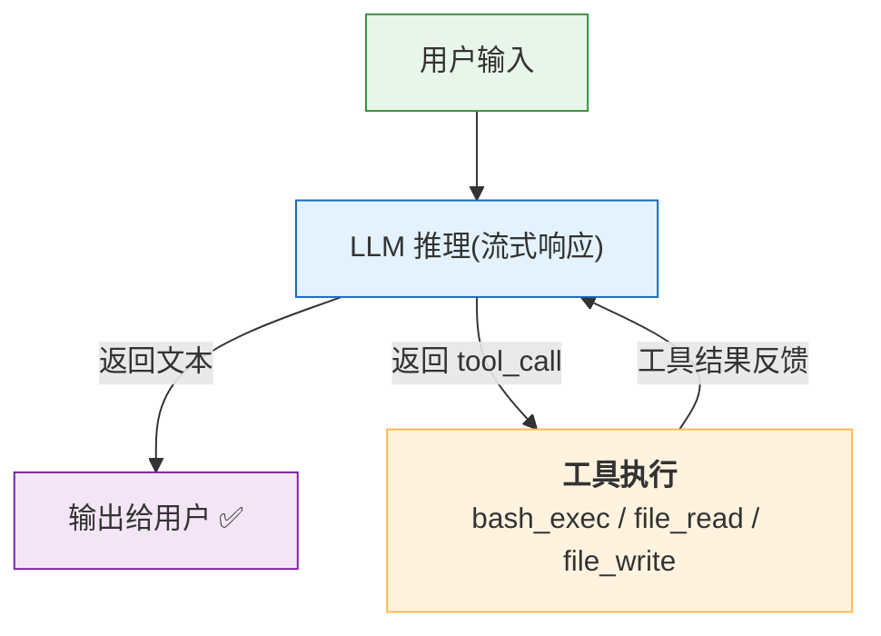

# MiniHarness 实战项目

本目录包含《智能体 Harness 工程指南》全书配套的实战项目—— **MiniHarness**，一个最小但完整的 Agent Harness 系统，使用 Python 实现。

## 快速开始

### 1. 安装依赖

首先创建虚拟环境并安装项目依赖：

```bash
cd lab

# 创建虚拟环境(推荐)
python3 -m venv venv
source venv/bin/activate

# 安装(开发模式)
pip install -e ".[dev]"
```

### 2. 配置 LLM

MiniHarness 兼容所有 OpenAI API 格式的 LLM 服务。复制 `.env.example` 并配置：

```bash
cp .env.example .env
```

支持的服务（任选其一）：

```bash
# OpenAI
export LLM_API_KEY="sk-xxx"
export LLM_BASE_URL="https://api.openai.com/v1"
export LLM_MODEL="gpt-4o-mini"

# DeepSeek
export LLM_API_KEY="sk-xxx"
export LLM_BASE_URL="https://api.deepseek.com"
export LLM_MODEL="deepseek-chat"

# 阿里通义千问
export LLM_API_KEY="sk-xxx"
export LLM_BASE_URL="https://dashscope.aliyuncs.com/compatible-mode/v1"
export LLM_MODEL="qwen-plus"

# Ollama 本地模型(无需付费 API Key)
export LLM_API_KEY="ollama"
export LLM_BASE_URL="http://localhost:11434/v1"
export LLM_MODEL="qwen2.5:7b"
```

### 3. 运行示例智能体

运行示例有两种方式：

```bash
# 方式一：命令行传入任务
python examples/simple_agent.py "列出当前目录的文件，并统计 Python 文件数量"

# 方式二：交互式输入
python examples/simple_agent.py
```

运行效果：

🤖 Agent 启动（模型：deepseek-chat，工具：3 个）
📝 用户：列出当前目录的文件，并统计 Python 文件数量

--- Turn 1 ---
🔧 执行 1 个工具调用：
   → bash_exec({"command": "ls -la && echo '---' && find . -name '*.py' | wc -l"})
   ← （523 字符）

--- Turn 2 ---
当前目录共有 15 个文件，其中 Python 文件有 29 个。

✅ Agent 完成（共 2 轮）

## 它是如何工作的

`examples/simple_agent.py` 实现了一个大约 200 行的完整 Agent，展示了 Harness 的核心循环：



关键组件对应关系：

| 示例中的代码 | MiniHarness 模块 | 书中章节 |
|-------------|-----------------|---------|
| `LLMClient` | `models/provider.py` → `OpenAIProvider` | 第7章 |
| `ToolRegistry` + `BashTool` | `tools/registry.py` + `tools/builtin.py` | 第5章 |
| `SimpleAgent.run()` 循环 | `runtime/engine.py` → `RuntimeEngine` | 第4章 |
| 流式事件输出 | `runtime/events.py` | 第4章 |

## 使用 MiniHarness 库编写自己的智能体

除了直接运行示例，你也可以在自己的代码中导入 MiniHarness 模块：

```python
import asyncio
from mini_harness.tools.builtin import BashTool, FileReadTool, FileWriteTool
from mini_harness.tools.registry import ToolRegistry
from mini_harness.models.provider import (
    ModelConfig, ModelProviderType, OpenAIProvider, create_provider
)

# 1. 注册工具
registry = ToolRegistry()
registry.register(BashTool())
registry.register(FileReadTool())
registry.register(FileWriteTool())

# 2. 创建 LLM Provider
config = ModelConfig(
    provider=ModelProviderType.OPENAI,
    model_id="deepseek-chat",
    api_key="sk-xxx",
    base_url="https://api.deepseek.com",
)
provider = create_provider(config)

# 3. 调用 LLM(带工具)
from mini_harness.models.provider import Message
tools = registry.list_tools()  # 获取 schema 列表
response = provider.complete_with_tools(
    messages=[Message("user", "用 bash 查看系统信息")],
    tools=tools,
)

print(response.content)
print(response.tool_calls)  # [{"id": "...", "name": "bash_exec", "arguments": {...}}]
```

**使用熔断器做故障转移**

```python
from mini_harness.models.provider import ModelConfig, ModelProviderType, ModelSelectionEngine

primary = ModelConfig(ModelProviderType.OPENAI, "gpt-4o", api_key="sk-xxx")
fallback = ModelConfig(ModelProviderType.OPENAI, "gpt-4o-mini", api_key="sk-xxx")

engine = ModelSelectionEngine(primary, fallback_chain=[fallback])

# 自动选择可用的模型
provider = engine.select_model()

try:
    response = provider.complete([Message("user", "Hello")])
    engine.mark_success(provider.config.model_id)
except Exception:
    engine.mark_failure(provider.config.model_id)
    # 下次调用 select_model() 会自动切换到 fallback
```

## 运行测试

使用 pytest 运行测试套件中的 230 个用例：

```bash
# 全部测试(230 个用例)
pytest tests/ -v

# 只跑某个模块的测试
pytest tests/unit/test_core.py -v
pytest tests/unit/test_tools.py -v
pytest tests/unit/test_memory.py -v
pytest tests/unit/test_models.py -v
pytest tests/unit/test_orchestration.py -v
pytest tests/unit/test_mcp.py -v
pytest tests/integration/test_runtime.py -v
```

## 项目结构

MiniHarness 的代码结构遵循《智能体 Harness 工程指南》的章节组织，如下所示：

```mermaid
graph TD
    A["lab/"]

    A --> B["<b>pyproject.toml</b><br/>项目配置和依赖"]
    A --> C["<b>.env.example</b><br/>环境变量示例"]
    A --> D["<b>README.md</b><br/>本文件"]

    A --> E["<b>mini_harness/</b><br/>源代码包"]
    E --> E1["<b>core/</b><br/>核心接口定义第2章"]
    E1 --> E1a["message.py"]
    E1 --> E1b["tool.py"]
    E1 --> E1c["agent.py"]
    E1 --> E1d["event.py"]

    E --> E2["<b>runtime/</b><br/>运行时引擎第4章"]
    E2 --> E2a["engine.py"]
    E2 --> E2b["models.py"]
    E2 --> E2c["events.py"]

    E --> E3["<b>tools/</b><br/>工具层第5章"]
    E3 --> E3a["registry.py"]
    E3 --> E3b["builtin.py"]

    E --> E4["<b>memory/</b><br/>记忆子系统第6章"]
    E4 --> E4a["storage.py"]
    E4 --> E4b["context.py"]
    E4 --> E4c["consolidation.py"]

    E --> E5["<b>models/</b><br/>模型集成第7章"]
    E5 --> E5a["provider.py"]
    E5 --> E5b["parser.py"]
    E5 --> E5c["quality.py"]

    E --> E6["<b>orchestration/</b><br/>任务编排第8章"]
    E6 --> E6a["engine.py"]

    E --> E7["<b>mcp/</b><br/>MCP集成第9章"]
    E7 --> E7a["integration.py"]

    E --> E8["<b>reliability/</b><br/>可靠性与可观测性第11章"]
    E --> E9["<b>security/</b><br/>安全防护第12章"]

    E --> E10["<b>utils/</b><br/>工具函数"]
    E10 --> E10a["config.py"]

    A --> F["<b>tests/</b><br/>测试套件230个用例"]
    F --> F1["<b>unit/</b><br/>单元测试"]
    F1 --> F1a["test_core.py"]
    F1 --> F1b["test_tools.py"]
    F1 --> F1c["test_memory.py"]
    F1 --> F1d["test_models.py"]
    F1 --> F1e["test_orchestration.py"]
    F1 --> F1f["test_mcp.py"]

    F --> F2["<b>integration/</b><br/>集成测试"]
    F2 --> F2a["test_runtime.py"]

    F --> F3["<b>fixtures/</b><br/>测试夹具"]

    A --> G["<b>examples/</b><br/>使用示例"]
    G --> G1["simple_agent.py"]

    style A fill:#e3f2fd
    style E fill:#fff3e0
    style F fill:#f3e5f5
    style G fill:#c8e6c9
```



## 章节对照

| 模块 | 对应章节 | 关键概念 |
|------|---------|---------|
| `core/` | 第2章：架构全景 | 消息系统、工具接口、事件定义 |
| `runtime/` | 第4章：运行时引擎 | 智能体循环、流式事件、状态管理 |
| `tools/` | 第5章：工具层设计 | 工具注册、执行流水线、内置工具 |
| `memory/` | 第6章：记忆子系统 | 多层记忆、上下文组装、自动整合 |
| `models/` | 第7章：模型集成 | 模型抽象、输出解析、质量门控、熔断器 |
| `orchestration/` | 第8章：任务编排 | 状态机、任务管理、子智能体 |
| `mcp/` | 第9章：MCP 集成 | 动态发现、Schema 缓存、工具适配 |
| `reliability/` | 第11章：可靠性 | 日志、追踪、监控、容错机制 |
| `security/` | 第12章：安全体系 | 权限、路径校验、护栏、安全执行 |

## 许可证

与本书一致，采用 [CC BY-NC-SA 4.0](https://creativecommons.org/licenses/by-nc-sa/4.0/) 许可证。
