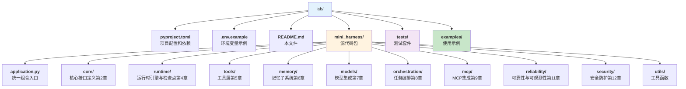

# MiniHarness 实战项目

本目录包含《智能体 Harness 工程指南》全书配套的实战项目—— **MiniHarness**，一个最小但完整的 Agent Harness 系统。完整的架构说明、代码索引和使用教程见[附录 D](../appendix/miniharness_index.md)。

## 快速开始

```bash
# 创建虚拟环境并安装
python3 -m venv venv
source venv/bin/activate
pip install -e ".[dev]"

# 配置 LLM（复制并编辑 .env）
cp .env.example .env

# 运行示例智能体（默认只开放只读文件工具）
python examples/simple_agent.py "读取 README.md 并总结项目"

# 运行全部测试
pytest tests/ --cov=mini_harness --cov-fail-under=80

# 运行与 CI 相同的静态检查和发行包构建
python -m mypy mini_harness
python -m pylint mini_harness
python -m build
```

MiniHarness 兼容所有 OpenAI API 格式的 LLM 服务（OpenAI、DeepSeek、通义千问、Ollama 等），详见 `.env.example`。

## 项目结构



## 章节对照

| 模块 | 对应章节 | 关键概念 |
|------|---------|---------|
| `core/` | 第2章：架构全景 | 消息系统、工具接口、事件定义 |
| `application.py` | 跨章节集成 | 上下文、安全执行、重试、事件追踪、检查点和工具路由 |
| `runtime/` | 第4章：运行时引擎 | 智能体循环、流式事件、状态管理、工具调用检查点 |
| `tools/` | 第5章：工具层设计 | 工具注册、执行流水线、内置工具 |
| `memory/` | 第6章：记忆子系统 | 多层记忆、上下文组装、自动整合 |
| `models/` | 第7章：模型集成 | 模型抽象、输出解析、质量门控、熔断器 |
| `orchestration/` | 第8章：任务编排 | 状态机、任务管理、子智能体 |
| `mcp/` | 第9章：MCP 集成 | 官方 SDK client、stdio/Streamable HTTP、认证、生命周期、动态发现与 Schema 缓存 |
| `reliability/` | 第11章：可靠性 | 日志、追踪、监控、容错机制 |
| `security/` | 第12章：安全体系 | 权限、路径校验、护栏、安全执行 |

## 许可证

与本书一致，采用 [CC BY-NC-SA 4.0](https://creativecommons.org/licenses/by-nc-sa/4.0/) 许可证。
